```{r setup, include=FALSE}
knitr::opts_chunk$set(echo = FALSE, warning = FALSE, message = FALSE,
                      fig.align = "center", out.width = "90%")
source("R/00_setup.R")
DATA_DIR <- "data"
```

# Introduction

Between 2013 and 2022, Istanbul hosted one of the world's largest urban migrant populations, approximately 500,000 registered migrants with temporary protection status, in a city with limited institutional integration infrastructure but an extraordinary informal social life in its public parks [@dgmm2022; @unhcr2022]. Most are Syrian nationals displaced after 2011, and we use 'migrant' throughout as shorthand for this Temporary Protection population, whose constraints on labour-market access and residency bear on the outcomes modelled here. The city's calisthenics parks, open-air street-workout facilities that spread through its neighbourhoods in the 2010s, became one of the few spaces where migrants and locals trained side by side without entry barriers, language requirements, or institutional mediation. The mechanisms studied below are not specific to Istanbul; they are portable to any city with migrant populations, outdoor training facilities, and seasonal weather.

This thesis asks whether that organic co-presence can be designed into a structured intervention that sustains integration beyond first contact. The research question is: *How do peer influence, group composition, facility continuity, and support services jointly affect motivation, language acquisition, social tie formation, and dropout among migrants and locals in a structured calisthenics programme?* The model is a tool for comparing programme designs before implementation rather than a forecasting instrument, and it reports three distinct outcomes (retention, cross-group bridging ties, and a CEFR language proxy) rather than a single integration index.

We address this question with an agent-based model because integration is an emergent phenomenon: group-level outcomes such as tie ratios, language gains, and retention arise from repeated interactions among heterogeneous agents whose behaviour depends on social feedback that standard regression cannot capture [@epstein2006]. The model embeds four mechanisms drawn from distinct theoretical traditions and tests their relative importance through controlled scenario comparison and global sensitivity analysis [@saltelli2008; @marino2008].

The evidence base for sport-based integration is thin on quantitative outcomes. A systematic review of 83 publications across 14 languages found no longitudinal studies measuring retention or integration outcomes [@spaaij2019]. The strongest causal evidence is @mousa2020, whose randomised controlled trial (N = 529) in post-ISIS Iraq found that Christians assigned Muslim soccer teammates were 49 percentage points more likely to train together six months later, though effects did not generalise off-field. On language, @kosyakova2021 track 13,187 refugees in Germany, finding destination-language proficiency rising by roughly one scale level per seven months of exposure. On adherence, @sperandei2016 reports 63% dropout within three months in unsupervised settings (N = 5,240), against @gjestvang2020's 57.2% still exercising at twelve months in supervised clubs (N = 250). No study combines all four outcome dimensions in a single longitudinal design.

Agent-based models have a long social-science lineage, from @schelling1971's segregation model to @axelrod1997's cultural dissemination, but none address structured integration programmes. Calisthenics is a useful test case: requiring no equipment, no shared language, and no prior experience, it offers a low-barrier, high-frequency communicative setting well suited to incidental language acquisition.

The thesis is structured as follows. Section 2 develops the theoretical framework and hypotheses; Section 3 specifies the model using the ODD protocol [@grimm2006; @grimm2010]; Section 4 reports the core results (pattern validation, the four hypothesis tests, heterogeneity, and global sensitivity); Section 5 summarises the further and robustness analyses; and Section 6 discusses mechanisms, policy implications, limitations, and conclusions, with the extended analyses reported in Appendix G.


# Theoretical Framework

## Self-Determination Theory and Motivation Dynamics

Self-Determination Theory identifies autonomy, competence, and relatedness as the needs whose satisfaction sustains intrinsic motivation [@deci2000]. The model operationalises this by encoding motivation as a continuous state variable on [0,1] that decays in the absence of social reinforcement and recovers through peer influence.

## Contact Hypothesis

Allport's [-@allport1954] Contact Hypothesis specifies four conditions under which intergroup contact reduces prejudice (equal status, common goals, cooperation, and institutional support), confirmed by a meta-analysis of 515 studies that also highlighted friendship potential as a facilitating factor [@pettigrew2006]. Structured calisthenics training satisfies all four conditions, and the model formalises the friendship pathway as tie formation during joint sessions, with tie strength growing through co-attendance and decaying in absence.

## Vygotsky and Language Acquisition in the Zone of Proximal Development

Vygotsky's [-@vygotsky1978] Zone of Proximal Development holds that language acquisition is most efficient just above a learner's current competence with the help of a more capable partner. Exercise cues during training provide situated, high-frequency practice, and the model implements a language-gain function calibrated to CEFR progression [@councileurope2001] with a linear ceiling factor $(1 - L/6)$ that produces diminishing returns as proficiency approaches C2. The ceiling is an empirical implementation of adult second-language plateau effects rather than a direct operationalisation of the ZPD.

## Granovetter's Threshold Model

Granovetter's [-@granovetter1978] threshold model holds that a participation cascade depends on the proportion of agents whose motivation exceeds their personal dropout threshold, producing threshold-dependent collapse rather than smooth decline. The model implements this as a continuous-state complex contagion: it integrates the tie-weighted average motivation of attending peers into each agent's motivation and applies a stochastic dropout rule to agents below the threshold $\theta_d = 0.20$ (a 20% weekly hazard). This places the dropout dynamics in the lineage simple contagion (SIR) → discrete threshold cascade [@granovetter1978] → continuous-state complex contagion [@centola2007].


## Research Question and Hypotheses

Taken together, the four theoretical traditions above motivate a single integrative research question:

> *How do peer influence, group composition, facility continuity, and support services jointly affect motivation, language acquisition, social tie formation, and dropout among migrants and locals in a structured calisthenics programme?*

We translate this question into four confirmatory hypotheses, each isolating one programme-design lever, grounded in a distinct mechanism, and tested against the Baseline by the manipulation named in parentheses (Table 3.3). Directional signs are stated a priori, before the evidence in Section 4.

**H1 (Peer influence).** Weakening the peer-influence coefficient (*Weak Peer Influence*: $\beta$ reduced from 0.08 to 0.03) **reduces retention**. Under Granovetter's [-@granovetter1978] threshold model and its complex-contagion extension [@centola2007], tie-weighted reinforcement is what holds motivation above the dropout threshold $\theta_d$; reducing the reinforcement gain should accelerate marginal dropout without necessarily collapsing the cohort.

**H2 (Group composition).** Reducing the local-to-migrant ratio (*Suboptimal Composition*: one local per park instead of five) **reduces retention, cross-group tie formation, and language gain**. The Contact Hypothesis [@allport1954; @pettigrew2006] holds that intergroup contact sustains tie formation and incidental language exposure only above a critical density of cross-group encounters; starving the programme of locals should be the single most damaging manipulation.

**H3 (Indoor facility continuity).** Removing the indoor winter training option (*No Indoor Continuity*) **reduces retention**, with the effect concentrated in the winter season. Continuity of physical access is a structural precondition for sustained participation; its loss should trigger a seasonal dropout cascade as motivation decays without compensating co-attendance.

**H4 (Support services).** Withdrawing stipends while retaining basic childcare (*Minimal Support*) **reduces retention**, with a disproportionate effect on women. Consistent with Self-Determination Theory [@deci2000] and the material-barrier evidence in the integration literature, removing financial support should eject the most resource-constrained participants first.

Following Meadows' [-@meadows1999] leverage-point hierarchy, we further predict that levers altering system *structure* (group composition, H2; facility access, H3) will outweigh those that merely tune *parameters and flows* (feedback gain, H1; support delivery, H4) -- an a-priori ordering of H2 > H3 > H1 > H4 that Section 4.2 and the Discussion revisit against the observed ranking.


# Model Description (ODD Protocol)

## Purpose

CIM v6.4 is designed to test policy-relevant interventions in a structured migrant--local calisthenics programme. The model asks: under what programme design conditions does year-round retention exceed 40%, language gains exceed A2 (CEFR $\geq$ 1.0), cross-group ties exceed 40%, and cost remain below \euro{}3,500 per retained participant (a target derived from comparable European community sport programmes)?

## Entities, State Variables, and Scales

**Grid**: 101 \(\times\) 101 patches; 1 patch \(\approx\) 100 m. **Time**: 1 tick = 1 week; 52 weeks total.

**Agents and key state variables:**

- *Migrants* (15 per park × 5 parks = 75 by default and in all BehaviorSpace experiments): `motivation` [0,1], `language-skill-cefr` [0,6], `ses-level` [0,1], `gender`, `arrival-cohort` (recent/established/settled), `prior-exercise-experience?`, `distance-to-park`, `has-dropped-out?`
- *Locals* (5 per park × 5 parks = 25 at setup in all BehaviorSpace experiments; Suboptimal Composition reduces effective population to 5 (1 per park), Phase 3 dose-response scenarios Composition2/3/4 to 10/15/20 (2/3/4 per park) by removing excess locals before week 1): same structure, no language variable, higher baseline motivation (0.5--0.9 vs 0.3--0.8 for migrants)
- *Trainers* (1 per park): `training-group-id`, `uses-bilingual-instruction?` (always true)
- *Parks* (5 by default and in all BehaviorSpace experiments): `has-indoor-partner?` (80% probability), `location-neighborhood`
- *Friendships* (links): `tie-strength` [0,1], `is-cross-group?`, `formed-week`


**Venue scope note.** Calisthenics parks are outdoor, male-predominant venues; the 50% female initialisation is a modelling idealisation that isolates post-arrival barriers conditional on enrolment and does not capture venue self-selection at entry, so gender-equity findings are conditional on attendance rather than population-wide (see Limitations).

## Process Overview and Scheduling

Each tick (week) executes the following sequence (phase-synchronous update):

1. `update-season`: weeks 1--8: outdoor; weeks 9--28: indoor (winter season, late autumn to early spring); weeks 29--52: outdoor (spring/summer return)
2. `weekly-participation-decisions`: each active agent decides independently whether to attend, based on motivation, barriers, and season
3. `conduct-training-sessions`: two sessions per week; motivation boosted per attending agent (+0.03); tie formation attempted (probability = `tie-formation-probability`)
4. `update-peer-influence`: motivation updated via tie-weighted peer influence
5. `update-friendship-networks`: ties strengthen (both ends active: +0.03), decay (inactive 2+ weeks: -0.02), or die (strength < 0.10)
6. `language-learning-from-sessions`: migrants gain CEFR points if locals are present
7. `apply-motivation-decay`: all non-dropped agents
8. `check-weekly-dropouts` and `check-spring-reentry`: four stochastic dropout triggers (the winter trigger is a temporary pause, not a permanent exit; paused agents may re-enter in spring, see Submodels)
9. `update-all-metrics`, `record-weekly-data`

The nine steps run as ordered phases within each tick, which avoids the path-dependence of fully agent-by-agent updating. The peer-influence and tie-update phases apply sequentially via NetLogo's `ask` and are therefore weakly order-sensitive, but every reported result is exactly reproducible under the fixed BehaviorSpace seed (Section 3.4).

## Design Concepts


**Stochasticity and reproducibility.** Under BehaviorSpace each run sets a deterministic seed (`random-seed (behaviorspace-run-number + run-start-index)`), so results are reproducible bit-for-bit by re-running the named experiment; interactive runs use a fresh seed. **Measurement estimand.** Primary outcomes are measured at week 52, the programme's terminal tick; because a 52-week pilot is a transient process rather than a system relaxing to equilibrium, the terminal-week value is the policy-relevant estimand.

**Causal structure.** The figure below presents the model's causal structure as a directed acyclic graph (DAG). Scenario assignment (the treatment) is randomised across BehaviorSpace replications, so by construction there are no pre-treatment confounders in the model world; agent-level state variables (motivation and the cross-group tie network) are post-treatment mediators. This delivers experimental-quality internal validity for scenario-level contrasts: any difference between scenarios in week-52 outcomes is attributable to the scenario configuration rather than to selection. Within-scenario correlations between the mediators and the outcomes are not causally identifiable, however; the scenario-level comparisons remain the primary source of causal claims (cf. Appendix G.3).

```{r fig_dag, echo=FALSE, fig.scap="Causal structure (DAG) of CIM v6.4", fig.cap="Causal structure of CIM v6.4 (directed acyclic graph). Treatment (blue): scenario assignment. Mediators (yellow): motivation and the cross-group tie network. Outcomes (green): retention at week 52, CEFR language gain, and cross-group tie ratio. Scenario-level contrasts are causally identified; within-scenario mediator--outcome correlations are not. \\textit{Note.} Replication and run counts are reported in Appendix B.", fig.pos="H", out.width="80%"}
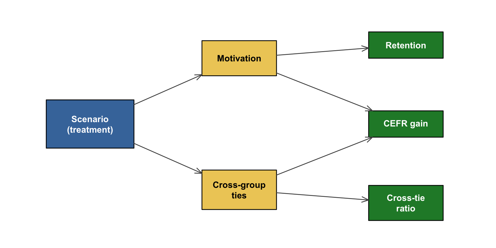
```

## Key Submodel Formulas

### Attendance Probability (Migrant)

$$P_{\text{attend}} = m_i \cdot 0.75 \cdot \prod_j M_j$$

where $M_j \in (0, 1.2]$ are barrier multipliers (baseline values in Table 3.1; the full barrier schedule is reported in Appendix A).

### Peer Influence (Tie-Weighted)

$$\Delta m_i = (\bar{m}_{\text{active}} - m_i) \cdot \bar{s}_{\text{active}} \cdot \beta$$

where $\bar{s}_{\text{active}}$ is the mean tie-strength of attending friends and $\beta = 0.08$ is the peer influence coefficient, calibrated from observed behavioural-spread coefficients in clustered social networks [@centola2010]. Normalisation by mean (rather than sum) tie-strength removes degree bias, ensuring agents with many weak ties are not artificially inflated relative to agents with few strong ties. Tie formation between co-attending agents occurs with probability $p_{\text{tie}} = 0.05$ per session, drawn from longitudinal social-network tie-formation studies [@kossinets2006].

### Language Gain (with Ceiling Factor)

$$\Delta L_i = \lambda \cdot q \cdot \eta \cdot \phi_{\text{friend}} \cdot N_{\text{sess}} \cdot h \cdot \left(1 - \frac{L_i}{6}\right)$$

where $q$ = interaction quality (locals attending / max), $\eta$ = efficiency multiplier (0.70), $\phi_{\text{friend}}$ = friendship bonus (1.15 if a local friend is attending), $N_{\text{sess}} = 2$ (sessions per week), $h = 1.0$ (hours per session); the ceiling factor $(1 - L_i/6)$ produces diminishing returns as proficiency approaches C2, consistent with Vygotsky's ZPD.

### Dropout Triggers (Weekly, Mutually Exclusive)

1. Motivation $< \theta_d$ and not attending: 20\% probability (motivation).
2. Work conflict and no stipend: 2\% migrants / 1\% locals (work).
3. Indoor season and no indoor partner: 5\% (winter pause).
4. Distance $>$ 5 patches and no transport: 3\% migrants / 1.5\% locals (distance).

Trigger 3 is a temporary winter pause rather than a permanent exit. A paused agent keeps its friendships and, each subsequent outdoor week, re-enters with probability $\min(0.70,\, 0.25 + 0.06\,k)$ in its current friend count $k$, recovering motivation to just above the dropout threshold (`check-spring-reentry`, evaluated every tick). An agent that fails to re-enter after six consecutive outdoor weeks becomes a permanent dropout recorded as `winter-no-return`, a fifth and terminal pathway distinct from the four weekly triggers above.

## Initialisation

Support services are allocated in three tiers based on SES: agents with SES < 0.3 receive stipend, childcare, and transport; moderate SES (0.3--0.6) receive childcare and 50% chance of transport; high SES receive no support. Additionally, agents living more than 5 patches from their park receive transport and stipend regardless of SES.

## Parameter Table

```{r param_table, echo=FALSE}
param_df <- data.frame(
  Parameter = c(
    "Motivation decay rate", "Peer influence coefficient",
    "Tie formation probability", "Dropout motivation threshold",
    "Motivation boost per session", "Tie strength growth (both active)",
    "Tie strength decay (inactive)", "Tie death threshold",
    "Language gain base rate", "Language interaction quality",
    "Friendship language bonus", "Work-conflict barrier (migrants)",
    "Childcare barrier female", "Distance barrier (>10 patches)",
    "Stipend bonus", "Dropout probability (low mot.)",
    "Dropout probability (work)", "Dropout probability (winter)",
    "Dropout probability (distance)", "Indoor facility probability",
    "Sessions per week"),
  Symbol = c("$\\gamma$","$\\beta$","$p_{tie}$","$\\theta_d$",
    "$\\Delta m$","$\\Delta s^+$","$\\Delta s^-$","$s_{min}$",
    "$\\lambda$","$\\eta$","$\\phi_f$","$B_w$","$B_c$","$B_d$",
    "$B_s$","$P_{mot}$","$P_{work}$","$P_{win}$","$P_{dist}$",
    "$P_{in}$","$N_s$"),
  Unit = c("week$^{-1}$","dimensionless","per session","scale [0,1]",
    "scale [0,1]","per week","per week","scale [0,1]",
    "CEFR/hour","dimensionless","dimensionless","multiplier",
    "multiplier","multiplier","multiplier","probability",
    "probability","probability","probability","probability","count"),
  Baseline = c("0.018","0.080","0.050","0.200","0.030","0.030","0.020",
    "0.100","0.019","0.700","1.150","0.700","0.600","0.500","1.200",
    "0.200","0.020","0.050","0.030","0.800","2"),
  Range = c("[0.010, 0.040]","[0.010, 0.200]","[0.020, 0.150]",
    "[0.100, 0.400]","fixed","fixed","fixed","fixed",
    "[0.010, 0.025]","fixed","fixed","[0.50, 0.90]",
    "[0.40, 0.80]","[0.30, 0.70]","fixed","[0.10, 0.35]",
    "fixed","fixed","fixed","fixed","fixed"),
  Source = c("Exercise-adherence data\\textsuperscript{1}","Social-contagion experiment\\textsuperscript{2}",
    "Network tie-formation\\textsuperscript{3}","SDT + threshold model\\textsuperscript{4}",
    "SDT competence feedback","Social reinforcement theory",
    "Friendship maintenance research","Network analysis convention",
    "CEFR acquisition rates\\textsuperscript{5}","L2 input-efficiency heuristic",
    "Situated-cognition heuristic","Urban migrant labour surveys",
    "Gender-disaggregated barrier data","Travel cost literature",
    "Programme incentive calibration","Granovetter threshold\\textsuperscript{6}",
    "Urban migrant employment data","Seasonal outdoor exercise data",
    "Transport barrier studies","Programme design baseline",
    "Programme protocol"),
  stringsAsFactors = FALSE
)
knitr::kable(param_df, booktabs = TRUE, escape = FALSE, longtable = TRUE,
  format = "latex", align = c("l","c","l","r","l","l"),
  caption = "Model parameters: meaning, baseline value, range, and justification.", caption.short = "Model parameters") |>
  kableExtra::kable_styling(font_size = 8,
    latex_options = c("repeat_header", "hold_position"),
    repeat_header_continued = "\\textit{(continued)}") |>
  kableExtra::column_spec(1, width = "3.5cm") |>
  kableExtra::column_spec(6, width = "3.5cm")
```

*Empirical-tier calibration sources (superscripts in the Source column): $^{1}$ @gjestvang2020; $^{2}$ @centola2010; $^{3}$ @kossinets2006; $^{4}$ @deci2000 and @granovetter1978; $^{5}$ @councileurope2001; $^{6}$ @granovetter1978. Parameters without a superscript are heuristic or policy-lever values (calibration tiers in Appendix E; full inventory in `config/schema.md`).*

*Note: The "range" column gives each parameter's plausible (admissible) bound. Four parameters ($\gamma$, $\beta$, $p_{tie}$, $\theta_d$) were varied in the global sensitivity analysis over a three-level grid lying within these bounds ($3^4 = 81$ combinations, 810 runs; the explicit grid levels are reported in Section 4.4); the remaining non-"fixed" ranges are plausible bounds documented for reference and domain adaptation, not swept. Partial rank correlation coefficient (PRCC) analysis identifies $\gamma$ (PRCC = -0.96 on retention) as the dominant parameter; Section 4.4 explores this dependence in detail.*

## Agent Population at Initialisation

Table 3.2 summarises the initial distributions of agent attributes at week 0
under Baseline conditions ($N = 100$ participant agents per run: 75 migrants and 25 locals; 5 trainers, one per park, facilitate sessions but are not counted in $N$).

The 3:1 migrant-to-local ratio reflects the policy-design target of a programme where majority-migrant attendance is expected but local presence must be sufficient to enable cross-group contact; it is a design choice, not an empirical demographic fact. The Low Park Density, Weak Peer Influence, and Suboptimal Composition scenarios (Table 3.3) stress-test this composition.


```{r agent_table, echo=FALSE}
agent_df <- data.frame(
  Attribute = c("Gender", "Motivation", "SES", "Prior exercise",
    "Months in country", "Initial CEFR", "Distance to park"),
  Migrants = c("50\\% female", "$U[0.3, 0.8]$ (+0.1 if prior ex.)",
    "$U[0, 1]$", "30\\% (Bernoulli)",
    "Exp($\\mu{=}12$), cap 60",
    "Recent: $U[0, 0.5]$; Estab.: $U[0.5, 1.5]$; Settled: $U[1.5, 3.0]$",
    "Euclidean to nearest"),
  Locals = c("50\\% female", "$U[0.5, 0.9]$ (+0.1 if prior ex.)",
    "$U[0, 1]$", "40\\% (Bernoulli)", "N/A", "N/A (native)",
    "Euclidean to nearest"),
  Source = c("Balanced", "SDT calibration", "Uniform", "Dishman (1988)",
    "Kosyakova (2022)", "Council of Europe (2001)", "Grid geometry"),
  stringsAsFactors = FALSE
)
knitr::kable(agent_df, booktabs = TRUE, escape = FALSE, format = "latex",
  col.names = c("Attribute", "Migrants (75)", "Locals (25)", "Source"),
  align = c("l","l","l","l"),
  caption = "Agent attribute distributions at initialisation (Baseline, week 0). Values drawn independently per agent per run.", caption.short = "Agent attribute distributions at initialisation") |>
  kableExtra::kable_styling(font_size = 8, latex_options = "hold_position") |>
  kableExtra::column_spec(2, width = "4.5cm") |>
  kableExtra::column_spec(3, width = "3.5cm")
```

Migrants start with lower baseline motivation ($U[0.3, 0.8]$ versus $U[0.5, 0.9]$ for locals) and less prior exercise experience (30% versus 40%, the latter conferring a $\times 0.90$ decay modifier), reflecting the compounding stressors facing forcibly displaced populations [@purgato2021]; these heterogeneous initial conditions produce the within-scenario variance seen in subsequent figures.

## Scenarios

Sixteen scenarios test specific mechanisms by modifying a subset of parameters at setup (Table 3.3). Fifteen are **policy levers** (directly modifiable programme design choices); one is a **contextual variable** (High SES Heterogeneity, a population characteristic not directly controlled by programme designers):

```{r scenario_table, echo=FALSE}
scen_df <- data.frame(
  Scenario = c("Baseline","No Indoor Continuity","Minimal Support",
    "Low Park Density","Weak Peer Influence","Suboptimal Composition",
    "Women-Only Groups","NoIndoor Minimal","Targeting50","Targeting70",
    "Targeting90","BuddyProgram","RotatingGroups","Winter50",
    "WomenChildcare","High SES Heterogeneity"),
  Type = c("Lever","Lever","Lever","Lever","Lever","Lever","Lever",
    "Lever","Lever","Lever","Lever","Lever","Lever","Lever","Lever","Context"),
  Mechanism = c("No modification",
    "has-indoor-partner = false all parks",
    "Stipend off; childcare reset",
    "Migrant distances $\\times$1.5",
    "$\\beta$ = 0.03", "1 local per park only",
    "50\\% parks women-only",
    "No indoor + minimal support (joint)",
    "SES targeting accuracy = 50\\%",
    "SES targeting accuracy = 70\\%",
    "SES targeting accuracy = 90\\%",
    "8-week local buddy assignment",
    "Group reshuffled every 4 weeks",
    "50\\% parks with indoor partner",
    "Women-only + universal childcare",
    "Bimodal SES distribution"),
  Hypothesis = c("Control","H3","H4","Spatial","H1","H2","EQ1",
    "H3+H4","Targeting","Targeting","Targeting",
    "Social facilitation","Composition dynamics","H3 partial",
    "EQ1+H4","Inequality"),
  stringsAsFactors = FALSE
)
knitr::kable(scen_df, booktabs = TRUE, escape = FALSE, format = "latex",
  col.names = c("Scenario","Type","Mechanism modified","Hypothesis"),
  align = c("l","l","l","l"),
  caption = "Scenario design: 16 original scenarios (15 policy levers + 1 contextual variable).", caption.short = "Scenario design (16 original scenarios)") |>
  kableExtra::kable_styling(font_size = 8, latex_options = "hold_position") |>
  kableExtra::column_spec(1, width = "3cm") |>
  kableExtra::column_spec(3, width = "5.5cm") |>
  kableExtra::footnote(
    general = "Phase 3 verification added 7 further robustness-family scenarios (Composition2/3/4, OpenPopulation, SuboptimalOpen, CentralityBuddy, RandomBuddy), bringing the v6.4 main pipeline to 23 scenarios (16 original plus 7 Phase 3 robustness extensions). Phase 3 scenarios are reported in Section 4.2 and Appendix G, with full statistical tables in Appendix F.",
    general_title = "Note: ",
    footnote_as_chunk = TRUE, threeparttable = TRUE,
    escape = TRUE
  )
```

## Pattern-Oriented Validation

Before running scenario experiments, we validated the baseline model against six stylised facts from the empirical literature, with explicit sources for each target range:

1. **Retention 40--60%** at week 52 (baseline: 45.1%). Supervised fitness club retention is ~57% at 12 months [@gjestvang2020]; unsupervised settings show ~4% [@sperandei2016]. We set the target range between these extremes, adjusted downward for the additional barriers facing migrant populations.
2. **Motivation at programme start ~0.55--0.75** (baseline: 0.617). Self-Determination Theory predicts lowest intrinsic motivation at initiation [@deci2000].
3. **Motivation at year end ~0.58--0.80** for survivors (baseline: 0.712). Survivor self-selection and competence growth raise motivation over time; a meta-analysis of physical-activity interventions with refugees [@purgato2021] reports a small self-efficacy improvement (SMD = -0.28).
4. **CEFR gain 0.8--1.5 units** over 52 weeks (baseline: 1.05). Longitudinal data on 13,187 refugees in Germany show self-reported destination-language proficiency rising by approximately one scale level per seven months of exposure [@kosyakova2021], which we map approximately onto CEFR levels, yielding ~1.7 levels/year under full immersion. We set a lower target (0.8--1.5) because sport provides partial, not full, language exposure.
5. **Cross-group tie ratio 0.30--0.55** (baseline: 0.502). The Contact Hypothesis meta-analysis (515 studies, N ~ 250,000) finds friendship contact reduces prejudice at r = -.25 (a stronger effect than the overall mean of r = -.21) [@pettigrew2006]; @mousa2020 demonstrates that structured sport contact generates strong direct behavioural ties in mixed groups, supporting ratios above natural homophily baselines.
6. **Cumulative dropout 40--60%** (baseline: 54.9%). Consistent with Dishman's canonical benchmark [@dishman1988] of ~50% dropout at six months and @gjestvang2020's 12-month follow-up data.

All six patterns were reproduced simultaneously at default parameter values, with ranges fixed before the baseline run and no post-hoc tuning against patterns 2--6. Pattern 1 (retention) is a consistency check rather than independent validation: its target draws on @gjestvang2021 while $\gamma$ is calibrated from @gjestvang2020, successive publications from the same Norwegian supervised-fitness-club cohort. The other five patterns draw on sources independent of $\gamma$'s calibration; this circularity is revisited in the Limitations.


# Results

Before reporting results, we briefly characterise the four dependent variables. *Retention* (% of agents remaining at week 52) is the primary outcome, ranging from 0% (all agents drop out) to 100% (none drop out). *Motivation* is a continuous variable on $[0, 1]$ that drives attendance decisions; its week-52 value reflects survivor-selected averages. *CEFR gain* measures cumulative language proficiency improvement over the programme year ($[0, 6]$ scale). *Cross-group tie ratio* measures the proportion of an agent's social ties that cross the migrant-local boundary, with higher values indicating greater social integration. All four outcomes are emergent: they arise from agent-level decisions and interactions, not from imposed aggregate rules.

*Unless otherwise noted, all figures and tables that follow are the author's own elaboration from CIM v6.4 simulation output; replication counts are reported in Appendix B.*


The table below summarises the empirical distribution of each outcome under Baseline conditions (N = 300 independent runs).

```{r table_summary, echo=FALSE}
summary_df <- data.frame(
  Variable = c("Retention (%)", "Motivation [0,1]", "CEFR Gain", "Cross-Group Tie Ratio", "Female Dropout (%)", "Male Dropout (%)"),
  Min = c(30.0, 0.569, 0.710, 0.208, 34.0, 33.3),
  Q1 = c(41.0, 0.680, 0.950, 0.456, 51.8, 48.7),
  Median = c(45.0, 0.716, 1.038, 0.508, 56.6, 53.7),
  Mean = c(45.1, 0.712, 1.046, 0.502, 56.3, 53.6),
  Q3 = c(49.0, 0.747, 1.141, 0.556, 61.0, 58.5),
  Max = c(61.0, 0.828, 1.446, 0.658, 76.5, 76.1),
  SD = c(5.5, 0.051, 0.141, 0.076, 7.2, 7.6)
)
knitr::kable(summary_df, booktabs = TRUE, format = "latex", align = c("l", rep("r", 7)),
  caption = "Five-number summary of Baseline outcome distributions (N = 300 runs). All values computed from simulation output.", caption.short = "Five-number summary of Baseline outcomes") |>
  kableExtra::kable_styling(font_size = 8, latex_options = "hold_position")
```

**Statistical power.** Each scenario reported in this section is the mean of 300 independent BehaviorSpace replications (500 for Low Park Density, Weak Peer Influence, and Women-Only Groups, which received top-up runs). Under a two-sample comparison at $\alpha = 0.05$ (two-sided) and 80\% power, this design detects standardised effects of $|d| \geq 0.23$ -- below the conventional small-effect threshold of $d = 0.20$, and well below the magnitudes reported for the four confirmatory hypotheses ($|d|$ ranging from 0.58 for H1 to 3.31 for H2). Non-significant scenario contrasts in this section should therefore be read as "no detectable effect at $|d| \geq 0.23$", not as "no effect."

## Pattern Validation

**Table 4.2** reports the pattern-validation results: all six empirical stylised facts fall within their target ranges simultaneously, confirming that the model is minimally calibrated before experiment analysis.

```{r table_validation, echo=FALSE}
val_table <- tryCatch(readRDS(file.path(DATA_DIR, "validation_table.rds")), error = function(e) NULL)
if (!is.null(val_table)) {
  knitr::kable(val_table, booktabs = TRUE, format = "latex",
    col.names = c("Pattern", "Unit", "Target Range", "Source / Rationale", "Model Value", "Status"),
    caption = "Pattern-oriented validation: CIM v6.4 baseline vs. empirical stylised facts (N = 300 runs).", caption.short = "Pattern-oriented validation",
    align = c("l","l","l","l","r","l")) |>
    kableExtra::kable_styling(font_size = 8, latex_options = "hold_position") |>
    kableExtra::column_spec(4, width = "4.5cm") |>
    kableExtra::footnote(
      symbol = "Motivation at week 52 reflects active surviving participants (survivor selection).",
      footnote_as_chunk = TRUE, threeparttable = TRUE, escape = TRUE
    )
} else {
  cat("*[Run R/10_validation_table.R to populate this table.]*")
}
```

## Scenario Comparisons

```{r load_results, echo=FALSE, message=FALSE}
results_df    <- tryCatch(readRDS(file.path(DATA_DIR, "results_df.rds")), error = function(e) NULL)
timeseries_df <- tryCatch(readRDS(file.path(DATA_DIR, "timeseries_df.rds")), error = function(e) NULL)
```

```{r table_descriptive, echo=FALSE}
if (!is.null(results_df)) {
  desc <- results_df |>
    group_by(scenario) |>
    summarise(
      N               = n(),
      `Retention (%)` = sprintf("%.1f (%.1f)", mean(retention_rate, na.rm=TRUE),
                                                 sd(retention_rate,   na.rm=TRUE)),
      `Motivation`    = sprintf("%.3f (%.3f)", mean(avg_motivation,   na.rm=TRUE),
                                                 sd(avg_motivation,     na.rm=TRUE)),
      `CEFR`          = sprintf("%.2f (%.2f)", mean(avg_language_cefr, na.rm=TRUE),
                                                 sd(avg_language_cefr,  na.rm=TRUE)),
      `Tie ratio`     = sprintf("%.3f (%.3f)", mean(cross_group_tie_ratio, na.rm=TRUE),
                                                 sd(cross_group_tie_ratio,  na.rm=TRUE)),
      `Dropouts`      = sprintf("%.1f (%.1f)", mean(100 - retention_rate,  na.rm=TRUE),
                                                 sd(100 - retention_rate,    na.rm=TRUE)),
      .groups = "drop"
    )
  knitr::kable(desc, booktabs = TRUE, format = "latex",
    caption = "Scenario outcomes at week 52 (mean, SD in parentheses; N = 300--500 runs per scenario, see Appendix B).", caption.short = "Scenario outcomes at week 52",
    align = c("l","r","l","l","l","l","l","l")) |>
    kableExtra::kable_styling(font_size = 7, latex_options = c("hold_position", "scale_down"))
} else {
  cat("*[Run R/01_load_data.R to populate this table.]*")
}
```

**Figure 4.1** shows the primary outcomes across all 23 scenarios, and **Figure 4.2** the two dynamic trajectories (weekly motivation and participation) for six policy-contrast scenarios.

```{r fig1, fig.scap="Scenario comparison across all 23 scenarios", fig.cap="Scenario comparison: dot-range plots of mean outcome at week 52 (IQR: 25th–75th percentile) across all 23 scenarios (16 original policy scenarios plus 7 Phase 3 robustness extensions, the latter also detailed in Section 4.2 and Appendices G.1, G.2, and G.4). A: retention rate; B: motivation; C: cross-group tie ratio; D: language proficiency (CEFR). Baseline mean shown as dashed reference line."}
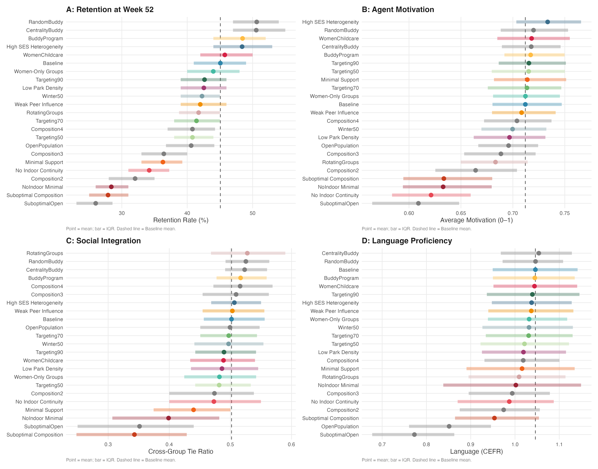
```

```{r fig2, fig.scap="Weekly motivation and participation trajectories", fig.cap="Weekly motivation (Panel A) and weekly participation count (Panel B) for six policy-contrast scenarios (Baseline, No Indoor Continuity, Minimal Support, BuddyProgram, WomenChildcare, and Targeting90). Median line with IQR ribbon across 300–500 runs per scenario. These two trajectories are the core dynamic outcomes; CEFR gain and cross-group tie ratio are cumulative endpoints reported in Table 4.3."}
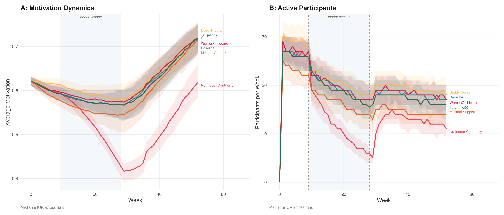
```

**H1 (Peer Influence):** Reducing $\beta$ from 0.08 to 0.03 produced a statistically significant but relatively modest 6.8% reduction in retention (mean baseline: 45.1% vs. 42.0%; *d* = -0.58, *p* < 0.001). Critically, cross-group tie ratio (+0.3%, *d* = +0.02), average motivation (-0.5%, *d* = -0.08), and language proficiency (-0.9%, *d* = -0.06) showed no statistically significant change after Holm correction [@holm1979] (all *p* = 1.00). This suggests that at the tested parameterisation, the peer influence mechanism primarily affects whether agents remain in the programme, but not the depth of integration among those who do; we note, however, that this survivor-conditioned null is also consistent with selection compression (higher-dropout scenarios retain a more self-selected pool), a confound we cannot fully separate here (see Limitations). The result is partially consistent with Granovetter's threshold model: the programme operates above the peer influence threshold at both $\beta$ values, so motivation does not collapse, but the reduced reinforcement accelerates marginal dropout.

**H2 (Group Composition):** Suboptimal composition (1 local per park instead of 5) produced the largest effects of any intervention: retention fell by 38.1% (17.2 pp; *d* = -3.31, *p* < 0.001), language gain by 8.8% (*d* = -0.65, *p* < 0.001), and cross-group tie ratio by 31.7% (*d* = -1.33, *p* < 0.001). Kaplan-Meier analysis shows similar median survival between Suboptimal Composition (36 weeks, 95% CI: 36--37) and Baseline, because the dropout cascade clusters at indoor-season onset (week 9) in both; the H2 effect is concentrated in the post-cascade tail, where the retention gap reaches 45.1% versus 27.9% at week 52. The result is consistent with the Contact Hypothesis: below a critical local-to-migrant ratio, intergroup contact is too sparse to sustain tie formation or incidental language learning. It also broadly supports Meadows' [-@meadows1999] leverage-point hierarchy, in which structural levers (composition, facilities) outrank flow levers (feedback gain, support); the one departure is that the observed ordering H2 > H3 > H4 > H1 reverses the predicted H1/H4 placement, because the programme sits above its peer-influence tipping point (Section 4.4), so weakening $\beta$ moves it toward but not past collapse whereas removing support ejects agents directly.

**H3 (Indoor Continuity):** Loss of indoor winter partnerships produced the second largest retention effect: a 24.1% reduction in retention (10.9 percentage point absolute decline; *d* = -2.13, *p* < 0.001). Median programme survival on the full cohort (migrants + locals) fell from 45 weeks (95% CI: 45--46) under Baseline to 40 weeks (95% CI: 40--40, tight) under No Indoor Continuity. The effect was concentrated in weeks 9--16 (the first weeks of the indoor season, onset week 9, late autumn), with female dropout rising by 18.1% and male dropout by 21.4% relative to baseline. Motivation dropped by 12.8% (*d* = -1.68, *p* < 0.001), which is consistent with physical-access loss during winter cascading into motivational collapse for agents who would otherwise continue.

**H4 (Support Services):** Removing stipends while retaining basic childcare (Minimal Support) reduced retention by 19.5% (*d* = -1.70, *p* < 0.001) and cross-group tie ratio by 12.4% (*d* = -0.69, *p* < 0.001). Average motivation showed no statistically significant change (+0.3%, *d* $\approx$ 0.04, *p* = 1.00 after Holm correction). Language proficiency showed a small negative effect (-2.9%, *d* = -0.19) that did not survive Holm correction (*p* = 0.098) and did not translate into a meaningful integration gap among participants who remained. Support removal therefore affects whether agents stay rather than the quality of their experience while participating. Female dropout rate increased by 9.5 percentage points (16.9% relative increase; *d* = 1.39, *p* < 0.001), as the loss of childcare support compounds with existing gender-specific attendance barriers, disproportionately pushing mothers out of the programme.


**Dose-response composition sweep.** To distinguish a threshold from a continuous response, we ran a five-point sweep at locals-per-park $\in \{1, 2, 3, 4, 5\}$ (dose 1 reuses Suboptimal Composition, dose 5 reuses Baseline; 300 runs each). Retention scales monotonically: 27.9%, 32.0%, 36.4%, 40.8%, and 45.1% across doses 1--5, with non-overlapping adjacent 95% CIs. A Kendall correlation rejects the no-trend null ($\tau = 0.621$, $p < 10^{-4}$), and a linear fit ($+4.31$ percentage points per added local) is preferred over a quadratic ($\Delta\text{AIC} = -1.96$), confirming an approximately linear dose-response without saturation in retention. The cross-group tie ratio, by contrast, saturates around dose 3 (0.509, 0.516, 0.502 for doses 3--5), consistent with a sufficient-bridge threshold beyond which additional locals add retention but not bridge density. The trend statistics are reported in Appendix F.2 and the per-dose means in Appendix F.3. The sweep upgrades H2 from a binary contrast to a continuous law and supports the Contact Hypothesis [@allport1954; @pettigrew2006].

\FloatBarrier

```{r fig_dose_response, echo=FALSE, fig.scap="Dose-response sweep of group composition", fig.cap="Dose-response sweep of group-composition manipulation. Locals-per-park varies across $\\{1, 2, 3, 4, 5\\}$; dose 1 reuses the Suboptimal Composition data, dose 5 reuses the Baseline data. Each point is the mean across 300 runs; error bars and ribbons show 95\\% CIs. Retention scales approximately linearly at $+4.31$ pp per additional local, while the cross-group tie ratio saturates around dose 3; motivation and CEFR gain rise monotonically with smaller magnitudes. Trend statistics (AIC comparison, Kendall's $\\tau$) are reported in Section 4.2 and Appendix F.2.", fig.pos="H", out.width="92%"}
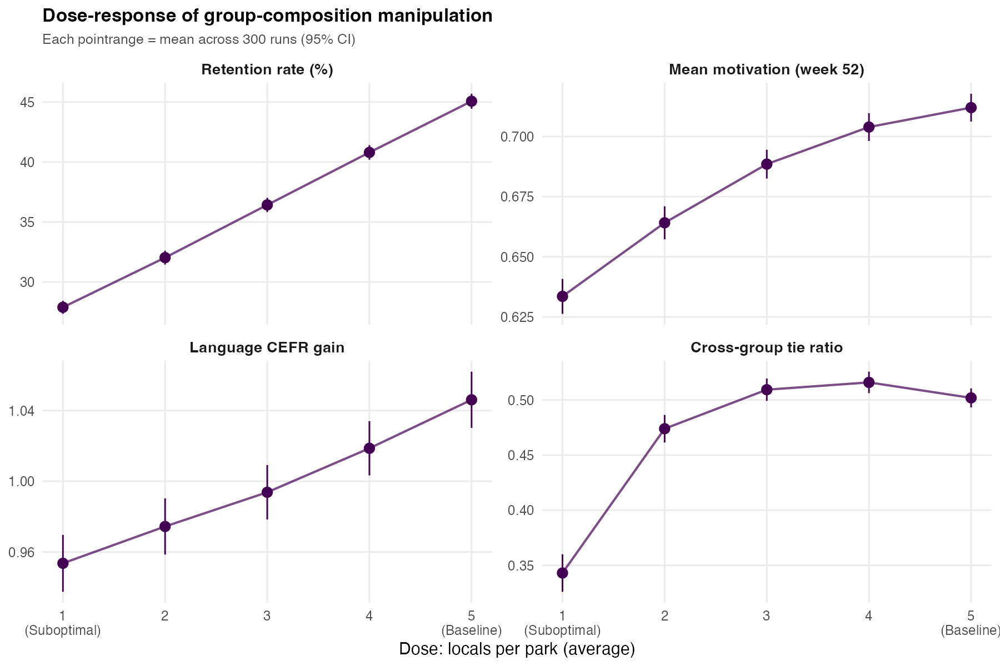
```

## Heterogeneity Analysis

**Gender.** At baseline, Kaplan-Meier [@kaplanmeier1958] analysis on the migrant-only Baseline cohort reveals a two-week gender gap in median programme survival: females 37 weeks (95% CI: 36--37) versus males 38 weeks (37--39). (The corresponding K-M on the Baseline cohort overall, including locals, yields a slightly larger three-week gap -- females 44 weeks vs males 47 weeks -- because locals have lower dropout hazard and pull the median rightward; we report the migrant-only specification here for consistency with the migrant-focused Cox PH model that follows.) The Cox proportional hazards model [@cox1972], fit to the migrant-only panel because the `arrival_cohort` covariate is migrant-specific ($N = 405{,}000$ agent-run observations), reports concordance 0.750 (the hazard ratios below are time-averaged effects: the proportional-hazards assumption is rejected, see Limitations, so they are not constant multiplicative shifts). Being male (reference: female) reduces dropout hazard by 8.1% (HR = 0.919, 95% CI: 0.905--0.934), independent of other covariates. Initial motivation (HR = 0.003 per unit on the 0--1 scale, i.e. HR $\approx$ 0.56 per 0.1-unit increase; the model converged with a tight confidence interval, so the small HR reflects the full-range scale rather than quasi-separation) and prior exercise experience (reference: no prior exercise; HR = 0.636, i.e., 36.4% lower hazard) are the strongest individual-level predictors of retention. Distance to park increases dropout hazard by 1.0% per patch (HR = 1.010, 95% CI: 1.010--1.011). Including scenario as a covariate alongside individual-level predictors creates potential ecological confounding, as scenario mechanically determines covariate distributions; the hazard ratios should therefore be interpreted as associations within the model world rather than causal effects. The proportional-hazards assumption is tested via Schoenfeld residuals and rejected globally (further detail in Limitations), so the hazard ratios are interpreted as time-averaged log-hazard effects over the 52-week observation window.

\FloatBarrier

```{r fig3, fig.scap="Female versus male dropout rates by scenario", fig.cap="Female versus male dropout rates by scenario (mean ± 1 SD across 300–500 runs). The gender gap is largest under Minimal Support (4.1 pp, driven by childcare removal) and Women-Only Groups (3.9 pp). WomenChildcare has the smallest gender gap of any scenario (about 0.5 pp), statistically indistinguishable from zero -- childcare brings female and male dropout to near-parity.", fig.pos="H"}
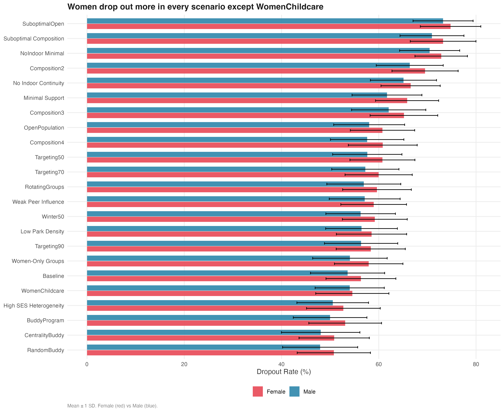
```

**Arrival cohort.** Recent-cohort migrants (less than 6 months in country) showed the largest CEFR gains across all scenarios, consistent with the linear ceiling-factor model: agents starting near A0 have maximum headroom for growth.

```{r fig4, fig.scap="Language gain by arrival cohort", fig.cap="Language gain (CEFR units, week 1 to week 52) by arrival cohort across all scenarios. Recent cohort (<6 months) shows the largest gains due to the linear ceiling factor; settled cohort (>18 months) shows the smallest gains.", out.width="85%"}
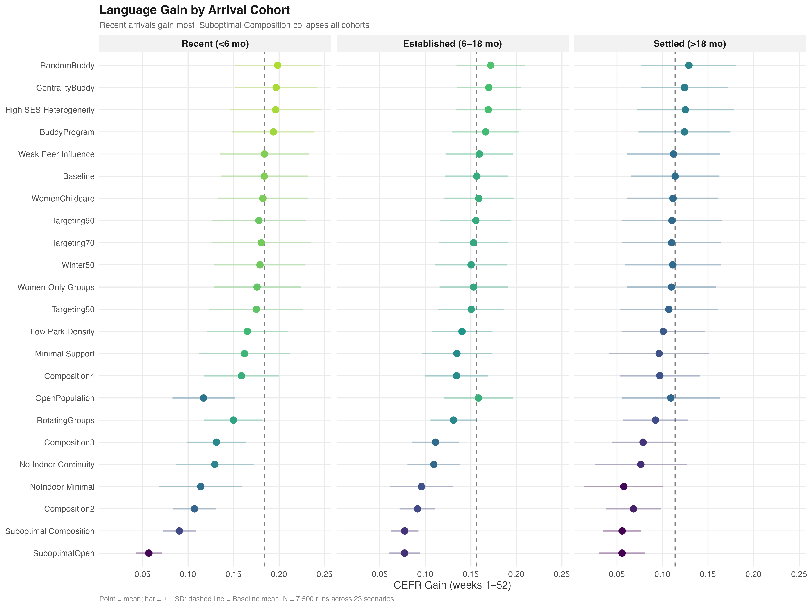
```

**Prior exercise experience.** Participants with prior exercise experience showed substantially lower dropout hazard (HR = 0.636 in the Cox model), widening the retention gap consistently across scenarios.

\FloatBarrier

```{r fig5, fig.scap="Retention by prior exercise experience", fig.cap="Retention rate by prior exercise experience across all scenarios. Prior exercisers show consistently 14--26 percentage point higher retention, driven by lower motivation decay and higher baseline motivation.", fig.pos="H", out.width="85%"}
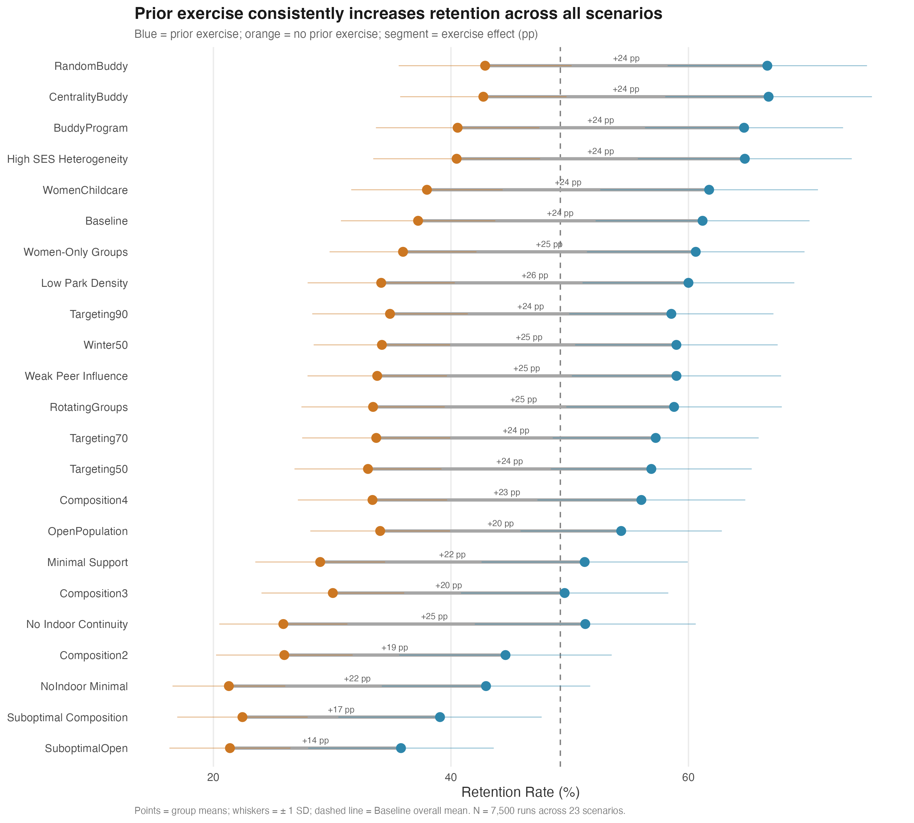
```

## Global Sensitivity Analysis

PRCC analysis across 810 runs (a $3^4$ factorial sweep at levels $\beta \in \{0.03, 0.115, 0.20\}$, $\gamma \in \{0.01, 0.02, 0.03\}$, $p_{tie} \in \{0.02, 0.085, 0.15\}$, $\theta_d \in \{0.10, 0.25, 0.40\}$, 10 replicates per cell) identifies **motivation decay rate ($\gamma$) as the dominant parameter** across all outcomes: PRCC = -0.96 for retention and +0.96 for total dropouts. Small calibration errors in $\gamma$ therefore produce large outcome changes, so the simulator's outputs are most contingent on this parameter's empirical calibration. Peer influence coefficient ($\beta$, PRCC = +0.31) and tie formation probability ($p_{tie}$, PRCC = +0.35) have moderate secondary effects on retention. Language proficiency and cross-group tie ratio are the most robust outcomes, with maximum $|\text{PRCC}| \approx 0.21$ (driven by $\gamma$).

The SIS analogy provides a heuristic threshold for cascade collapse. A naive mean-field estimate gives $R_{0,\text{bare}} = \beta / \gamma = 0.08 / 0.018 \approx 4.4$, treating $\beta$ as a per-tie reinforcement rate. The model's peer-influence rule (Section 3.5) normalizes reinforcement by the mean tie strength of attending friends ($\bar{s}$), however, so the effective restoring rate per tick is $\bar{s} \cdot \beta$ rather than $\beta$ alone. Computing the mean strength of surviving friendship ties at week 52 directly from the per-run edge files (300 baseline runs) yields $\bar{s} = 0.354$ and $\langle k \rangle = 0.91$, giving a normalized estimate $R_{0,\text{norm}} = \bar{s} \cdot \beta / \gamma \approx 1.57$. Both interpretations place baseline above the critical threshold of 1, but the normalized estimate suggests the system operates closer to criticality than the bare ratio implies, consistent with the strong sensitivity of retention to scenario perturbations observed in Section 4.2 (Suboptimal Composition reduces $\bar{s}$ to 0.326 and $\langle k \rangle$ to 0.36, producing a 38.1% retention drop). The Weak Peer Influence scenario ($\beta = 0.03$) reduces $R_{0,\text{bare}}$ to 1.67 and $R_{0,\text{norm}}$ to 0.59; the model shows modest motivation effects but not full collapse, indicating that CIM's richer dynamics (continuous-state motivation, prior-exercise resilience, multiple dropout triggers) extend the operating range beyond what a strict SIS mapping would predict.

\FloatBarrier

```{r fig6, fig.scap="PRCC tornado plot (global sensitivity)", fig.cap="PRCC tornado plot for the four sensitivity parameters across five outcomes. Bar length represents PRCC magnitude; colour indicates direction (blue = positive association, red = negative). Motivation decay rate (γ) dominates all outcomes.", fig.pos="H"}
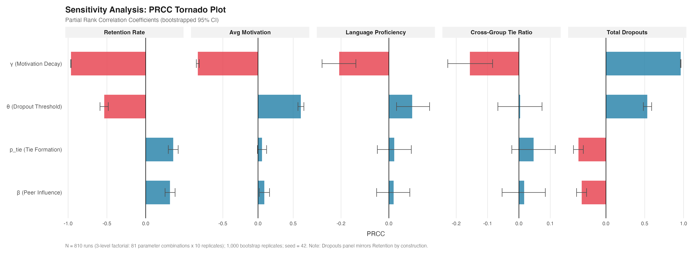
```


# Further Analysis

Beyond the four confirmatory hypotheses, a set of extensions probe programme-design variants and stress-test the robustness of the rankings. Each is summarised here and reported in full in Appendix G.

Eleven exploratory designs vary targeting accuracy, social facilitation, and gender-equity combinations (Appendix G.1). The clearest practical signal comes from the buddy programmes, where the retention gain depends on *when* a migrant is paired with a local rather than *how* the buddy is chosen. The week-0 BuddyProgram reaches 48.5%, while both week-8 variants reach 50.6%, and a degree-targeted buddy (CentralityBuddy) is statistically indistinguishable from a randomly chosen one (RandomBuddy) on all six outcomes ($d = -0.012$, $p_{\text{Holm}} = 1.00$). Raising SES targeting from 50% to 90% accuracy recovers retention from 40.8% to 42.6%.

A static link-prediction test asks whether the friendship graph carries learnable structure or merely random within-group ties (Appendix G.2). The three triadic-closure predictors reach mean AUCs between 0.735 and 0.761, each rejecting the chance value of 0.5 at $p < 10^{-4}$, whereas preferential attachment performs no better than chance ($\text{AUC} \approx 0.50$). Ties form through shared neighbours and repeated co-attendance, consistent with Granovetter's weak-tie account and Centola's complex contagion, and inconsistent with a degree-driven "rich get richer" process.

The structural network analysis confirms that the bridges between migrants and locals are weak ties (Appendix G.3). Cross-group ties are weaker than within-group ties in 14 of the 16 original scenarios (pooled $d = -0.41$, $p < 10^{-4}$), and among cross-group ties the weaker ones carry higher edge betweenness ($\rho = -0.43$, $p < 10^{-4}$, $N = 1{,}179$), so the most fragile ties do the most bridging work. Co-attendance and cross-group friendship are positively associated ($\rho = +0.66$), as the Contact Hypothesis predicts.

Three robustness extensions probe the durability of the rankings (Appendix G.4). Motivation decay $\gamma$ is the dominant parameter (PRCC $= -0.96$), and a $\pm 40\%$ bracket on $\gamma$ shifts absolute Baseline retention across a wide range while leaving the scenario ordering intact. Adding mid-programme arrivals and departures lowers retention modestly (40.6% open versus 45.1% closed, $d = -0.82$) but leaves the cross-group tie ratio and five further graph metrics essentially unchanged (six-of-six with $|d| < 0.17$), and the Baseline-over-Suboptimal ranking survives the churn.

Finally, a mechanism benchmark tests whether the tie-weighted peer-influence rule is doing real work or could be replaced by any contagion rule (Appendix G.5). Substituting a simpler contact-presence rule changes the headline outcome substantially, raising retention to 57.5% against the tie-weighted 45.1% (Cohen's $d = 2.24$, $p < 0.001$), while leaving language gain and tie ratio unchanged. The two specifications are not equifinal: the choice of motivation mechanism is consequential, so the main results are not an artefact of a permissive modelling choice.

A second-domain portability test re-runs the design comparisons under a Berlin state-funded language-course calibration (3,900 runs across thirteen scenarios; Appendix G.4). Of the four fully-testable Istanbul ranking relations, only two transfer: withholding support still lowers retention sharply (Minimal Support 51.2\% versus Baseline 67.0\%, $d = 3.40$, $p < 10^{-4}$), but the two peer-mediated relations, the group-composition gap and the BuddyProgram premium over Baseline, collapse to near-ties once attendance is funding-enforced rather than peer-reinforced (the higher-performing designs cluster at 66 to 68\% retention, differences of 0.3 to 0.5 pp, not significant). The framework's fine-grained rankings are therefore bounded to peer-reinforced venues.

# Discussion and Conclusion

## Mechanisms

The ranking of intervention effectiveness partly departs from the initial hypotheses, with suboptimal group composition (H2) the most damaging lever and weak peer influence (H1) the least: H2 > H3 > H4 > H1. This hierarchy matters for programme design: the Contact Hypothesis mechanisms (group composition, H2) prove more powerful than the social contagion mechanisms (peer influence, H1) at the parameter ranges tested. The peer-influence mechanism is nonetheless doing real work rather than standing in for any contagion rule, as the alternative-mechanism benchmark establishes (Appendix G.5).

Two distinct pathways emerge. The *structural access pathway* (facilities, group composition → attendance opportunity → integration) is disrupted by H3 and H2. The *social reinforcement pathway* (peer influence → motivation → sustained attendance → ties) is disrupted by H1 and H4. A key asymmetry: the structural pathway has roughly twice the effect magnitude, and material support operates through attendance opportunity rather than motivation (Minimal Support reduces retention 19.5% with no motivation change).

## Policy Implications

**Probability of meeting targets.** Across the four policy targets (retention $\geq 40\%$, tie ratio $\geq 0.40$, cost $\leq$ \euro{}3,500, CEFR $\geq 1.0$), the buddy-pairing designs lead on the joint probability and the two failing scenarios meet none of them (figure below). The week-8 variants achieve the highest joint probability, ahead of the week-0 BuddyProgram and the High SES Heterogeneity context, with Suboptimal Composition and NoIndoor Minimal at zero.

**Cost model.** Cost per retained participant is the total annual programme budget divided by the number of agents remaining at week 52. Each park has a fixed annual budget of EUR 28,000, for a total of EUR 140,000 across 5 parks; stipends and childcare enter as attendance multipliers rather than explicit line items. Because the per-park budget is fixed, the EUR 3,500 target equals the 40\% retention floor for the closed 100-agent cohort (EUR 140,000 / 40), so the cost and retention targets coincide for closed scenarios and diverge only under open-population churn.

**Cost-effectiveness frontier.** Plotting retention against cost (figure below), High SES Heterogeneity and BuddyProgram sit near the efficiency frontier, while No Indoor Continuity and Suboptimal Composition are dominated.

**Equity.** The figure below shows the gender dropout gap by scenario. Minimal Support (+4.1 pp) shows the largest gap, driven by childcare removal. Women-Only Groups (+3.9 pp) is close behind, arising because removing cross-gender contact reduces the social reinforcement available to women (cross-group ties fall 3.9%, *d* = -0.25). WomenChildcare is the only scenario where the gap is not statistically distinguishable from zero (+0.5 pp; 95% CI: [-0.6, 1.6]), bringing the gender gap to near-parity rather than reversing it (the +0.5 pp lies within Monte-Carlo noise, not a female advantage). Gendered programme spaces require careful design to avoid inadvertently increasing female attrition.

Four model-derived design principles emerge from the scenario ranking:

1. **Maintain group composition at 5 locals per 15 migrants per park (baseline).** Group composition (H2) has the largest single-scenario effect on all integration outcomes. Reducing to 1 local per park (the Suboptimal Composition manipulation) reduces cross-group tie formation by 31.7% and reduces language gain by 8.8% (actual observed in model). The model suggests that composition ratios deserve priority attention in programme design.

2. **Protect indoor winter partnerships.** Indoor facility continuity (H3) has the second largest effect, with dropout spikes concentrated in weeks 9--16 (winter onset at week 9, approximately two-week mechanism lag; see the dropout-timing figure in Appendix G.1). In the model's cost assumption, a \euro{}500/month indoor rental subsidy is cost-effective relative to the alternative: a 10.9 percentage point (24.1% relative) retention collapse and the motivational cascades it triggers. The real-world cost-effectiveness conclusion depends on local rental markets and is not a direct empirical claim.

3. **Calibrate support-service targeting accuracy.** Minimal Support increases the female dropout rate by 9.5 percentage points (16.9% relative increase), disproportionately driven by childcare removal. The model's tiered support system (stipend + childcare for SES < 0.3) concentrates resources where motivation would otherwise collapse fastest; the Targeting50/70/90 scenarios show that higher targeting accuracy partially recovers retention, though even Targeting90 (42.6%) remains significantly below Baseline (45.1%; $d = -0.43$, $p < 0.001$). A controlled targeted-vs-uniform comparison would require an additional scenario beyond the current accuracy-only sweep.

4. **Consider structured buddy pairing, and pair *late* rather than at launch.** BuddyProgram (week-0 pairing) reaches 48.5% retention at \euro{}2,929 per retained; both week-8 variants reach about 50.6%, and the +2.1 pp uplift comes from *pairing timing* (week 8 versus week 0), not pairing criterion: a degree-based buddy does not beat a randomly chosen one at week 8 (Appendix G.1). For managers, this means deferring buddy assignment by eight weeks captures the additional retention with no need to collect network information at launch.

```{r fig9_cost, fig.scap="Cost-effectiveness frontier", fig.cap="Cost-effectiveness frontier. Each point = mean across N = 300–500 runs (scenario-dependent); bubble size = cross-group tie ratio; error bars = ±1 SE. Dashed lines indicate policy targets (retention ≥ 40%, cost ≤ EUR 3,500). The buddy-pairing scenarios and the High SES Heterogeneity context variable achieve the best cost-retention balance; among actionable levers the week-8 buddy variants (CentralityBuddy, RandomBuddy) are highest-yield, ahead of the week-0 BuddyProgram."}
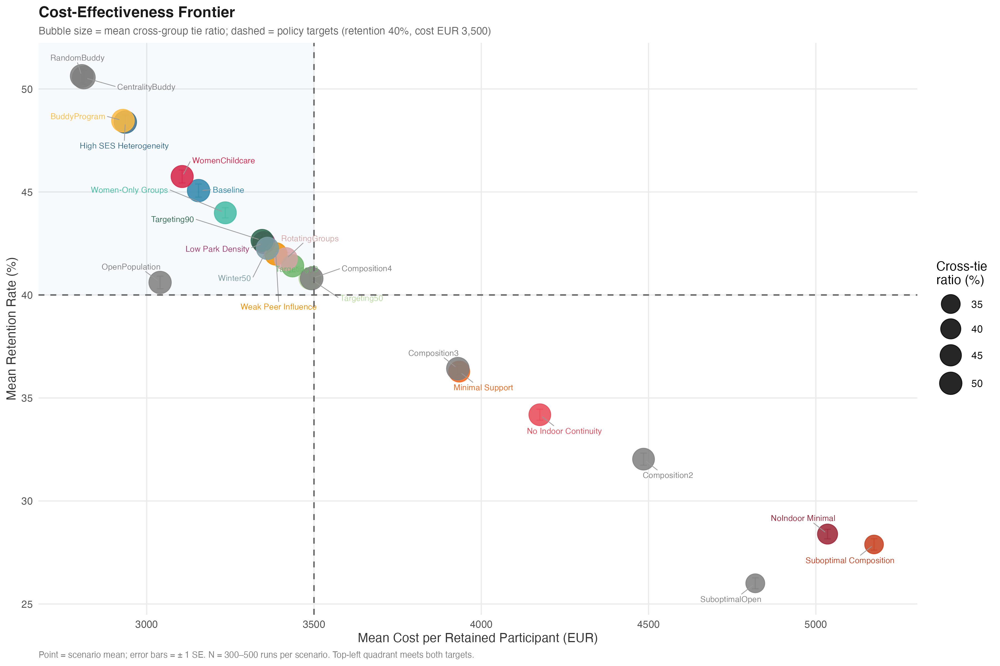
```

```{r fig10_targets, fig.scap="Probability of meeting policy targets", fig.cap="Probability of meeting individual and joint policy targets by scenario (N = 300–500 runs per scenario). Purple = low probability; yellow = high probability. The week-8 buddy variants lead (CentralityBuddy 65.3%, RandomBuddy 60.3%), ahead of the week-0 BuddyProgram at 57.7%; High SES Heterogeneity reaches 52.3%; Baseline achieves 49.7%; Suboptimal Composition and NoIndoor Minimal fail all targets (p-joint = 0%)."}
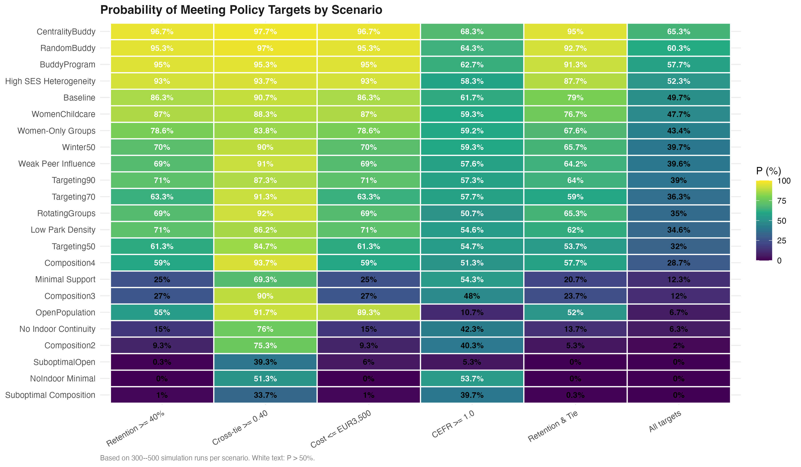
```

```{r fig11_equity, fig.scap="Gender dropout gap by scenario", fig.cap="Gender dropout gap (female minus male dropout rate, percentage points) by scenario. Positive = female dropout higher. Minimal Support (+4.1 pp) produces the largest gap, with Women-Only Groups (+3.9 pp) close behind; most other scenarios cluster between +2.5 and +3.3 pp. WomenChildcare (+0.5 pp; 95% CI: [−0.6, 1.6]) is the only scenario where the gap is statistically indistinguishable from zero, bringing female and male dropout to near-parity (within Monte-Carlo noise, not a female advantage)."}
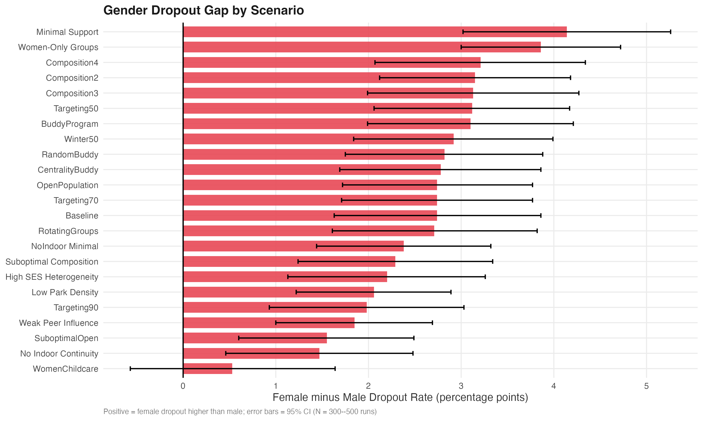
```

The equity frontier (figure below) combines cost, retention, and migrant social isolation into a single view, in which Suboptimal Composition and NoIndoor Minimal sit in the worst quadrant on all three dimensions at once.

```{r fig_equity_frontier, echo=FALSE, fig.scap="Equity frontier: cost vs. social isolation", fig.cap="Equity frontier: cost per retained participant (x-axis) vs migrant social isolation rate (y-axis, proportion with zero cross-group friends at week 52). Bubble size = mean retention rate. Circles = policy levers; grey × = context variable (High SES Heterogeneity, not directly actionable). Suboptimal Composition and NoIndoor Minimal dominate the high-cost, high-isolation region.", out.width="95%"}
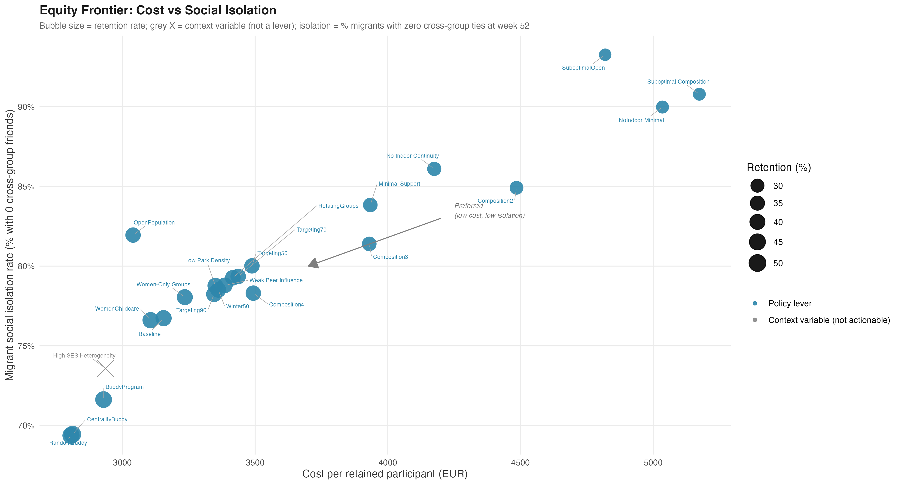
```


## Limitations

The model makes several simplifying assumptions that bound its generalisability.

*Fixed structure.* The model uses a single pilot with fixed park locations and homogeneous, bilingual trainers; a multi-district or variable-trainer application would require recalibrating the distance-penalty, park-count, and peer-influence parameters to the target setting.

*Population dynamics.* The v6.4 model did not incorporate new migrant arrivals during the programme year. The open-population extension (Appendix G.4) tests this: absolute Baseline retention shifts by $-4.5$ percentage points under the calibrated arrival/departure rates ($p_{\text{in}} = 0.30$, $p_{\text{out}} = 0.20$ per week); the cross-group tie ratio AND five additional graph-structure metrics (modularity, clustering, giant-component fraction, breed assortativity, within- and cross-group tie strengths) are all essentially unchanged (six-of-six metrics with $|d| < 0.17$, all Holm-adjusted $p > 0.4$). The Baseline-vs-Suboptimal ranking is empirically preserved under churn (Suboptimal closed 27.9% vs SuboptimalOpen 26.0%; gap from Baseline narrows from 17.2 pp closed to 14.6 pp open but remains highly significant). The remaining H1, H3, H4 confirmatory manipulations were not re-run under open-population conditions. Programmes with higher turnover than tested would require independent calibration.

*Calibration sensitivity and validation circularity.* Global sensitivity analysis identifies $\gamma$ (motivation decay rate) as the dominant parameter (PRCC = -0.96), so empirical calibration of this parameter carries the weight of the absolute retention estimates. The $\gamma$ calibration uses Norwegian supervised fitness-club data [@gjestvang2020] and the retention validation target (40--60\%, Section 3.10) uses [@gjestvang2021]; these are successive publications from the same Norwegian cohort, so pattern reproduction against them is a consistency check on the parameterisation rather than an independent validation. That data may not transfer to migrants, who face compounding stressors (legal-status uncertainty, economic precarity, cultural dislocation) that plausibly raise $\gamma$ above the general-population baseline. The $\pm 40\%$ gamma-bracket test in Appendix G.4 shows scenario rankings preserved across the bracket while absolute retention levels shift substantially. Independent validation against an actual migrant-sport programme remains unavailable; no such longitudinal dataset exists in the published literature [@spaaij2019].

*Survival-model specification.* The Cox proportional-hazards model used in the heterogeneity analysis fails its central assumption: a Schoenfeld-residual test rejects proportionality at $p < 0.001$ (global $\chi^2 = 16{,}122$ on 22 degrees of freedom, $N = 405{,}000$). This is a violation of constancy, not of internal validity, so the hazard ratios are read as time-averaged effects over the 52-week window, and as associations within the model world rather than causal effects. The full specification is given in Appendix D.1.

*Gender and venue self-selection.* The Women-Only Groups scenario reduces cross-group tie formation by 3.9\% ($d = -0.25$) because women-only spaces limit mixed-gender contact; real-world safety benefits for female participants that increase attendance propensity are not currently captured in the attendance probability function. More fundamentally, the model does not represent gender-based venue self-selection at programme entry. The 50/50 gender initialisation assumes arrival parity at the calisthenics park, whereas empirical evidence from gendered public-space research indicates that women's use of outdoor male-predominant exercise venues is structurally lower than men's [@koskela1999; @phadke2011], and cultural and religious norms further reduce participation of Syrian women in Turkey's Temporary Protection population independent of childcare availability [@kaya2017]. The `WomenChildcare` scenario addresses childcare barriers but does not address venue-choice constraints. Findings concerning female participation therefore apply to the subset of migrant women who are candidates for calisthenics-park enrolment, not to the full migrant female population.

*Survivor selection.* Week-52 outcomes (motivation, language, ties) are computed for survivors only; scenarios with higher dropout have more severe survivor selection, which compresses apparent outcome differences among remaining participants. An intent-to-treat analysis would strengthen comparisons of quality-of-experience metrics across scenarios.

*Framework-generality boundary.* The Berlin second-domain test (Appendix G.4) documents a boundary on the framework-generality claim: the peer-mediated rankings -- both the Suboptimal Composition gap and the BuddyProgram premium over Baseline -- do not transfer to a state-funded, teacher-led classroom where attendance is externally enforced; only the gross provide-versus-withhold-support distinction (Minimal Support < Baseline) survives in both domains. Ranking invariance among high-performing designs should therefore be asserted only for venues where attendance is peer-reinforced rather than externally enforced. Other rankings may have analogous boundaries that a broader set of second-domain tests would reveal.

**Empirical calibration boundaries.** Each validation target (Section 3.10) is interpolated from adjacent literature rather than a matched programme. The retention target (40--60%) rests on general exercise adherence [@gjestvang2021; @sperandei2016]; the CEFR gain target (0.8--1.5 levels) is calibrated to total-immersion refugee exposure [@kosyakova2021], which likely overestimates gains from two sport sessions per week alone; and the cross-group tie ratio target (0.30--0.55) has no direct sport-integration comparator. @mousa2020 demonstrates that structured sport generates direct behavioural ties but does not report network-level ratios, and also found that intergroup contact effects did not generalise to off-field social behaviours, so the tie-based integration measure may overstate real-world integration if training-context ties do not transfer to broader social life. These gaps mean the model is best read as a *hypothesis-generating* tool: the scenario rankings are more reliable than the absolute outcome magnitudes.


**Surrogate model.** An earlier linear emulator predicting retention from simulation outputs was tautological, since all predictors were post-treatment outputs of the same run; it is therefore not reported, and decision support rests on scenario contrasts and policy-target probabilities instead.

**Other bounds.** The global sensitivity analysis perturbs only four parameters ($\beta$, $\gamma$, $p_{\text{tie}}$, $\theta_d$), so rankings could in principle be sensitive to the fixed parameters; the PRCC estimates are version-invariant across v6.2--v6.4 (Appendix F.8). The scenario set tests single levers rather than stacked positive interventions (e.g., BuddyProgram with WomenChildcare), a priority for future work. As with any agent-based model, external validity is bounded to the model world, so the direction of effects rather than their magnitudes is the inference, and measurement validity is limited by the CEFR proxy and the exercise-adherence calibration of $\gamma$.


**Multiple comparisons.** Hypothesis tests are partitioned into confirmatory, exploratory, and robustness families, with Holm correction applied separately within each, so that family-wise error is controlled without diluting confirmatory power (full breakdown in Appendix D.1).

**Causal scaffolding.** Because peer influence deliberately violates agent-level SUTVA, the simulation run is treated as the unit of analysis (300 independent seeds per scenario, with standard errors clustered by run), and scenario contrasts are run-level intent-to-treat estimates (Appendix D.1).


## Conclusion

Scoped to migrants under Turkey's Temporary Protection Regulation who take part in outdoor community-sport programmes, this thesis has shown that sport-based integration can be represented as an agent-based system in which programme-level outcomes emerge from the interplay of peer influence, tie formation, and motivation decay. Across 7,500 primary simulation runs spanning twenty-two policy levers and one contextual variable, group composition and indoor facility continuity are the two levers with the largest effect on programme survival, while peer influence plays a secondary but significant role. The practical reading is that programmes built around physical infrastructure alone, or social motivation alone, will underperform relative to their cost unless they also attend to structural group composition, at least in venues where attendance is peer-reinforced; where attendance is externally enforced, as the Berlin second-domain test shows, the composition lever weakens and other levers should take priority.

Several simplifications mark the road ahead. Language proficiency is modelled as a pure output rather than feeding back into motivation, the cohort is held closed in the main pipeline, and the per-session motivation boost is constant, omitting the competence milestones that Self-Determination Theory would predict. The most useful next steps are a pilot programme that tests these predictions against survey data on motivation, language, and network composition; full integration of population turnover; an L1--L2 linguistic-distance term in the language submodel; and multi-site calibration against existing sport-for-integration programmes. Programme managers could also exploit the friendship-paradox property of social networks [@christakis2010] to detect dropout cascades early, monitoring a small set of high-centrality migrants rather than a uniform sample, since high-centrality nodes are reached earlier in any spreading process on the network.

The model, data, and analysis code are fully open-source and reproducible, implemented in NetLogo [@wilensky1999] with analysis in R, in keeping with the standards of Computational Social Science [@lazer2009]. The calisthenics parks of Istanbul, where migrants and locals first trained side by side, remain the empirical horizon toward which this model-world tool points: a future in which programme design is tested computationally before it is tested on people.


# References {-}

```{=latex}
\printbibliography[heading=none]
\let\printbibliography\relax
```

::: {#refs}
:::


# Appendix A: ODD Protocol (Full Technical Specification) {-}

```{=latex}
\renewcommand{\thetable}{A.\arabic{table}}
\renewcommand{\thefigure}{A.\arabic{figure}}
\setcounter{table}{0}
\setcounter{figure}{0}
```

## ODD Design Concepts {-}

**Emergence.** Macro-level outcomes (retention rate, cross-group tie ratio, language distribution) emerge from micro-level decisions; they are not imposed. **Adaptation.** Agents adapt weekly by deciding whether to attend based on their current motivation and environmental barriers. **Sensing.** Agents sense their own motivation, the attendance of neighbours in their social network, and whether a facility is available. **Interaction.** Agents interact through co-attendance at parks: social ties form between co-attendees, and peer influence flows through these ties. **Stochasticity.** Agent attributes are initialised from distributions (Table 3.2); attendance, tie formation, and dropout are stochastic. **Objectives.** Agents do not optimise an explicit objective function; their attendance decisions follow a probabilistic rule based on current motivation and barriers. **Learning.** Agents do not modify their decision rules over time; however, their motivation state evolves through peer influence and decay, producing adaptive behaviour. **Prediction.** Agents do not anticipate future states. **Collectives.** Agents do not form explicit groups beyond the emergent friendship network; the BuddyProgram scenario introduces mandated dyadic pairings. **Observation.** Retention rate, mean motivation, mean CEFR, cross-group tie ratio, and gender-disaggregated dropout are recorded weekly.


*[Reference the NetLogo code file \path{CIM_v6_4.nlogo} for the complete implementation. The pre-v6.4 source \path{CIM_v6_3.nlogo} is preserved at the repository root. Release contents and task-level indexing are documented in \path{CHANGELOG.md}.]*


## Submodel parameter schedule {-}

The attendance-probability barrier multipliers $M_j \in (0, 1.2]$ take the following baseline values:

- Work conflict: 0.7
- Childcare: 0.6 (female), 0.8 (male)
- Distance 5--7.5 patches: 0.85; 7.5--10 patches: 0.70; above 10 patches: 0.5
- Stipend receipt: 1.2 (bonus)
- Transport access: 1.1 (bonus)
- Indoor season without facility: 0.65; with facility: 0.90
- Female outdoor safety penalty: 20\% probability of 0.9
- BuddyProgram local-active boost: 1.15 for 8 weeks

Motivation decay is modulated by SES as $\gamma \cdot (1.2 - \mathrm{SES} \cdot 0.4)$; by absence (1.20 when not attending); and by prior exercise experience (0.90). Ties formed during the programme start at strength 0.3; initial (week-0) network ties and buddy-assigned pairs start at 0.2.

# Appendix B: BehaviorSpace Experiment Design {-}

```{=latex}
\renewcommand{\thetable}{B.\arabic{table}}
\renewcommand{\thefigure}{B.\arabic{figure}}
\setcounter{table}{0}
\setcounter{figure}{0}
```

All experiments were executed via NetLogo 7.0.3 BehaviorSpace in headless mode using `run_all_experiments.sh`.

```{r appendix_b_table, echo=FALSE}
bs_exp <- tibble::tribble(
  ~Experiment, ~Scenario, ~`N`, ~`Key parameter`,
  "Baseline_300runs", "Baseline", 300L, "All default",
  "NoIndoor_300runs", "No Indoor Continuity", 300L, "has-indoor-partner? = false",
  "MinimalSupport_300runs", "Minimal Support", 300L, "receives-stipend? = false",
  "LowParkDensity_300runs", "Low Park Density", 300L, "distances x1.5",
  "LowPark_topup200runs", "Low Park Density (top-up)", 200L, "additional replicates, same config",
  "WeakPeer_300runs", "Weak Peer Influence", 300L, "beta = 0.03",
  "WeakPeer_topup200runs", "Weak Peer Influence (top-up)", 200L, "additional replicates, same config",
  "SuboptimalComp_300runs", "Suboptimal Composition", 300L, "1 local per park",
  "Composition2_300runs", "Composition2", 300L, "2 locals per park (dose 2)",
  "Composition3_300runs", "Composition3", 300L, "3 locals per park (dose 3)",
  "Composition4_300runs", "Composition4", 300L, "4 locals per park (dose 4)",
  "HighSES_300runs", "High SES Heterogeneity", 300L, "Bimodal SES",
  "WomenOnly_300runs", "Women-Only Groups", 300L, "50% parks women-only",
  "WomenOnly_topup200runs", "Women-Only Groups (top-up)", 200L, "additional replicates, same config",
  "NoIndoorMinimal_300runs", "NoIndoor Minimal", 300L, "No indoor + minimal support",
  "Targeting50_300runs", "Targeting50", 300L, "targeting-accuracy = 0.5",
  "Targeting70_300runs", "Targeting70", 300L, "targeting-accuracy = 0.7",
  "Targeting90_300runs", "Targeting90", 300L, "targeting-accuracy = 0.9",
  "BuddyProgram_300runs", "BuddyProgram", 300L, "buddy-program-k = 8",
  "CentralityBuddy_300runs", "CentralityBuddy", 300L, "week-8 highest-degree buddy",
  "RandomBuddy_300runs", "RandomBuddy", 300L, "week-8 random buddy",
  "RotatingGroups_300runs", "RotatingGroups", 300L, "rotation-period-weeks = 4",
  "Winter50_300runs", "Winter50", 300L, "50% parks with indoor partner",
  "WomenChildcare_300runs", "WomenChildcare", 300L, "Women-only + universal childcare",
  "Sensitivity_3level", "Baseline", 810L, "3-level sweep of beta, gamma, p_tie, theta_d",
  "Equifinality_ContactContagion_100runs", "Alt. Mechanism Benchmark", 100L, "use-contagion-influence? = true",
  "OpenPopulation_300runs", "Open Population", 300L, "p_in = 0.30, p_out = 0.20",
  "SuboptimalOpen_300runs", "SuboptimalOpen", 300L, "1 local per park + p_in = 0.30, p_out = 0.20",
  "GammaBracket_Low_300runs", "Baseline + BuddyProgram + Suboptimal", 900L, "gamma = 0.011",
  "GammaBracket_High_300runs", "Baseline + BuddyProgram + Suboptimal", 900L, "gamma = 0.025",
  "Berlin_AllScenarios_300runs", "13 scenarios (Berlin config)", 3900L, "config-domain = language-course-berlin"
)
knitr::kable(bs_exp, booktabs = TRUE, longtable = TRUE, format = "latex",
             align = c("l","l","r","l"),
             caption = "BehaviorSpace experiment design (v6.4, all tiers).", caption.short = "BehaviorSpace experiment design") |>
  kableExtra::kable_styling(font_size = 7, latex_options = c("repeat_header"),
                            repeat_header_continued = "\\textit{(continued)}") |>
  kableExtra::column_spec(1, width = "4.6cm") |>
  kableExtra::column_spec(2, width = "2.8cm") |>
  kableExtra::column_spec(3, width = "0.8cm") |>
  kableExtra::column_spec(4, width = "4.6cm")
```

**Total (v6.4 main pipeline)**: 23 policy scenarios -- 13 original at 300 runs each + 3 original at 500 runs each (Low Park Density, Weak Peer Influence, Women-Only Groups: base 300 + top-up 200) + 7 Phase 3 robustness-family scenarios at 300 runs each (Composition2, Composition3, Composition4, OpenPopulation, SuboptimalOpen, CentralityBuddy, RandomBuddy) = 7,500 policy scenario runs ((13 \times 300) + (3 \times 500) + (7 \times 300) = 3,900 + 1,500 + 2,100 = 7,500). Plus 810 sensitivity runs (Sensitivity\_3level) + 100 auxiliary runs (Alternative Mechanism Benchmark) = **8,410 main-pipeline runs**.

**Total (v6.4 Tier 3 framework-generality additions, excluding OpenPopulation which is already counted in the 7,500 main-pipeline runs above)**: GammaBracket_Low 900 + GammaBracket_High 900 + Berlin_AllScenarios 3,900 = **5,700 Tier 3 framework-generality runs**.

**Grand total**: 8,410 + 5,700 = **14,110 BehaviorSpace runs**.

*Note: The 7,500 policy scenario runs and 100 auxiliary runs are reported separately throughout the thesis. Of the 7,500 policy runs, 5,400 belong to the original 16 scenarios (confirmatory + exploratory families) and 2,100 to the Phase 3 robustness-family extensions (Composition2/3/4, OpenPopulation, SuboptimalOpen, CentralityBuddy, RandomBuddy). Sensitivity runs (810) are used exclusively for PRCC analysis. Tier 3 framework-generality runs (5,700, excluding OpenPopulation which is dual-counted in the main pipeline) support framework-generality claims in Appendix G.4.*

# Appendix C: R Analysis Pipeline {-}

```{=latex}
\renewcommand{\thetable}{C.\arabic{table}}
\renewcommand{\thefigure}{C.\arabic{figure}}
\setcounter{table}{0}
\setcounter{figure}{0}
```

All analysis performed in R (version $\geq$ 4.3). Scripts in `R/` directory, executed from the `CIM_Model/` working directory. All scripts source `R/constants.R` for shared targets and scenario classification (single source of truth):

- `constants.R`: policy targets, winter onset (week 9), scenario classification (`POLICY_LEVERS` holds the original 15 levers + 1 context; the 7 Phase 3 robustness scenarios are classified in the robustness family of `03_hypothesis_tests.R`, plus 1 auxiliary --- 22 levers + 1 context + 1 auxiliary across the v6.4 main pipeline)
- `00_setup.R`: package installation and shared constants
- `00_run_all.R`: execute full pipeline in sequence
- `01_load_data.R`: read and clean NetLogo CSV outputs (last-block deduplication; 23 scenarios as of Phase 3 verification round 2)
- `02_descriptive_stats.R`: summary statistics and bimodality tests
- `03_hypothesis_tests.R`: Welch's t-tests with Holm correction (3 families: 24 confirmatory + 66 exploratory + 42 robustness = 132 tests)
- `04_sensitivity_analysis.R`: rank-based PRCC analysis via `sensitivity::pcc()`
- `05_survival_analysis.R`: Kaplan-Meier and Cox proportional hazards
- `06_visualization.R`: all figures (publication-quality, scenario palette)
- `07_thesis_tables.R`: LaTeX/CSV tables
- `08_network_analysis.R`: degree distribution, assortativity, mixing matrices
- `09_policy_outputs.R`: cost-effectiveness frontier, equity analysis
- `10_validation_table.R`: face validity and pattern validity checks
- `11_agent_hazard.R`: discrete-time dropout hazard (real agent-week panel)
- `12_distributional.R`: quantile ribbons, tail risk, dropout distributions
- `13_surrogate.R`: scenario comparison delta table (surrogate regression removed; information leakage identified, see Limitations)
- `14_internal_invariants.R`: 10 automated mechanism invariant checks (11 sub-checks)
- `15_equifinality.R`: Alternative Mechanism Benchmark (contact-presence contagion)
- `16_tier3_blockj_analysis.R`: gamma-bracket, open-population, and sensitivity-provenance analyses
- `17_tier3_blocki_analysis.R`: Berlin second-domain ranking-invariance analysis
- `18_tier3_integrate.R`: results integration into thesis text
- `19_tier3_splice_and_ship.R`: delivery bundle assembly
- `20_sna_graph_analysis.R`: Structural network analysis from edge files (modularity, betweenness, clustering, weak ties; original 16 scenarios)
- `21_r_naught.R` (Phase 2 Item 3): R$_0$ derivation from observed network statistics across scenarios
- `22_did_parallel_trends.R` (Phase 2 Item 9): Difference-in-differences parallel-trends test for time-varying-treatment scenarios
- `23_randomization_inference.R` (Phase 2 Item 7): randomization-inference robustness check on 24 confirmatory comparisons (10,000 permutations)
- `24_dose_response.R`: dose-response composition sweep with Kendall rank correlation, linear/quadratic regression, AIC + LRT comparison
- `25_link_prediction.R`: static link-prediction with 4 predictors (Adamic-Adar, common neighbours, Jaccard, preferential attachment) on 964 successfully-analysed runs
- `26_open_population_analysis.R`: Welch + Cohen's d on 6 outcomes for OpenPopulation vs Baseline with comparative-magnitude vs H1-H4
- `27_centrality_buddy_analysis.R` (verification round 2): 4-way comparison Baseline / BuddyProgram / RandomBuddy / CentralityBuddy with 36 pairwise tests
- `28_open_pop_sna.R` (Phase 3 verification round 1): multi-metric SNA on Baseline vs OpenPopulation (6 graph-theoretic metrics)
- `29_suboptimal_open_test.R` (Phase 3 verification round 2): 2x2 factorial test of Baseline-vs-Suboptimal ranking-preservation under open-population
- `extra_agent_fate.R`: Agent fate heatmap (individual-level outcome visualisation)

# Appendix D: Full Hypothesis Test Results {-}

```{=latex}
\renewcommand{\thetable}{D.\arabic{table}}
\renewcommand{\thefigure}{D.\arabic{figure}}
\setcounter{table}{0}
\setcounter{figure}{0}
```

The table below reports all 132 pairwise comparisons (22 non-baseline scenarios across 6 outcomes) with Holm-corrected p-values, applied separately within three pre-specified families to control the family-wise error rate without diluting power across unrelated test sets. The confirmatory family corresponds to H1--H4 (4 scenarios x 6 outcomes = 24 tests). The exploratory family covers the 11 remaining original scenarios (High SES Heterogeneity, Women-Only Groups, NoIndoor Minimal, Targeting50/70/90, BuddyProgram, RotatingGroups, Winter50, WomenChildcare, Low Park Density; 11 x 6 = 66 tests). The auxiliary Equifinality benchmark is reported separately (Appendix G.5) and is not part of this family. The Phase 3 robustness family covers the 7 verification-round extensions (Composition2/3/4 for the dose-response sweep, OpenPopulation, SuboptimalOpen, CentralityBuddy, RandomBuddy; 7 x 6 = 42 tests). Holm correction is computed within each family separately rather than pooled across all 132 tests.

```{=latex}
\input{tables/table_full_tests_appendix.tex}
```


## D.1 Statistical-inference methods and disclosures {-}

*Survival-model specification.* The Cox proportional hazards model (Section 4.3) includes `initial_motivation` as a pre-treatment baseline covariate, assigned at agent creation before any scenario effect applies. Because `initial_motivation` is independent of scenario assignment, it is a legitimate baseline control, not a mediator. Robust standard errors are clustered by simulation run to address within-run correlation between agents sharing the same random seed. The proportional-hazards assumption, tested via Schoenfeld residuals, is rejected at $p < 0.001$ for gender, `initial_motivation`, `distance_to_park`, SES, prior exercise, and scenario assignment, and also for `arrival_cohort` ($p = 0.004$), with the global $\chi^2 = 16{,}122$ on 22 degrees of freedom (migrant-only fit, $N = 405{,}000$ agent-run observations). Two clarifications follow. First, this is a violation of constancy (the hazard ratio varies over the 52-week window), not of internal validity: in the Rubin selection-bias decomposition, the bias term $E[Y_{0i} \mid D_i = 1] - E[Y_{0i} \mid D_i = 0]$ is structurally zero in this design because BehaviorSpace draws independent random seeds for each replication, so the potential-outcome distributions $Y_0$ are identically distributed across scenarios in expectation. The reported hazard ratios therefore retain causal interpretation as time-averaged log-hazard effects of scenario assignment over the 52-week observation window, not constant multiplicative shifts. Second, the Schoenfeld $\chi^2$ is highly sensitive to minor departures from proportionality at this sample size; the magnitudes of the violations are not necessarily scientifically consequential. Time-varying coefficient extensions (interval-split hazards, `tt()` terms in `coxph`) remain a priority for follow-up work. Finally, the model reports its covariate hazard ratios without a formal multiple-comparisons correction across the covariate set; given the sample size ($N = 405{,}000$), the principal predictors (initial motivation, prior exercise, gender, and distance to park) are significant by margins that no standard correction (Holm or Bonferroni) would overturn, though any marginal covariate should be read with that caveat in mind.

**Pre-registration and multiple-comparisons structure.** Hypothesis tests are partitioned into three families, with Holm correction applied separately within each (following peer-review feedback during thesis development, extended for the Phase 3 robustness extensions). The **confirmatory family** comprises the four scenarios that directly implement the four pre-specified hypotheses: Weak Peer Influence (H1), Suboptimal Composition (H2), No Indoor Continuity (H3), and Minimal Support (H4). Across six outcomes (retention, motivation, CEFR gain, cross-group tie ratio, female dropout rate, male dropout rate) this yields $4 \times 6 = 24$ confirmatory comparisons. The **exploratory family** comprises the eleven remaining original scenarios (High SES Heterogeneity, Women-Only Groups, NoIndoor Minimal, Targeting50/70/90, BuddyProgram, RotatingGroups, Winter50, WomenChildcare, Low Park Density), yielding $11 \times 6 = 66$ exploratory comparisons. The **robustness family** comprises the seven Phase 3 robustness-extension scenarios (Composition2, Composition3, Composition4, OpenPopulation, SuboptimalOpen, CentralityBuddy, RandomBuddy; the latter two added in the verification round to disentangle timing from criterion in Item 10, and SuboptimalOpen added to test the open-cohort ranking-preservation conjecture), yielding $7 \times 6 = 42$ robustness comparisons. Separating the three families preserves family-wise error rate at $\alpha = 0.05$ within each interpretive category and avoids the dilution of confirmatory power that arises when interpretively distinct tests are pooled under a single Holm correction. The split is implemented in `R/03_hypothesis_tests.R`.

**Causal-inference scaffolding.** The model deliberately violates the agent-level Stable Unit Treatment Value Assumption (SUTVA): peer influence is the mechanism of interest, not a nuisance, so an agent's outcome depends on the treatments received by other agents in the same training group. We therefore treat the simulation **run** as the unit of analysis (300 independent random seeds per scenario; standard errors clustered by `run_id` throughout the survival analysis), at which level SUTVA holds by construction since seeds are independent. Reported scenario contrasts are intent-to-treat (ITT) estimates of the effect of *assigning* a cohort to a scenario configuration; under the model's perfect compliance at the run level, run-level ITT and run-level average treatment effect coincide. The agent-level intent-to-treat refinement noted under *Survivor selection* above would require an additional cohort-conditioning specification and is reserved for follow-up work.

# Appendix E: Model Configuration Files {-}

```{=latex}
\renewcommand{\thetable}{E.\arabic{table}}
\renewcommand{\thefigure}{E.\arabic{figure}}
\setcounter{table}{0}
\setcounter{figure}{0}
```

## Framework Generality {-}

The model is structured as three loosely coupled layers. The **mechanism layer**, implemented in `CIM_v6_4.nlogo`, encodes the domain-agnostic dynamics of structured community-sport programmes: peer-mediated motivation dynamics, threshold-based dropout, tie formation and decay, seasonal participation disruption, and language acquisition through repeated co-presence with native speakers. The **configuration layer** is a CSV file (\path{config/calisthenics-istanbul.csv}) that documents every empirically calibrated or heuristically chosen parameter with its value, unit, admissible range, source, description, calibration tier, and scenario scope. The **case layer** is the application of the mechanism layer under a specific configuration: in this paper, Istanbul calisthenics parks during the 2013--2022 Temporary Protection period.

This layering is the architectural response to a suggestion received during thesis review from the program director: that the simulator, not only the analyses derived from it, is a primary contribution, and should therefore be general enough to admit configurations for other community-sport contexts (e.g., an adult language-café cohort, a community boxing programme, a youth football league). At setup the model loads the selected domain configuration: it first applies an inline copy of the named domain (guaranteeing correct behaviour in every environment, including the sandboxed GUI), then, where file access is available (e.g. headless runs), reads \path{config/<domain>.csv} from disk so that an edited CSV overrides the inline values. The release ships two worked configurations: \path{config/calisthenics-istanbul.csv} (the calibrated Istanbul case) and \path{config/language-course-berlin.csv} (the second-domain transfer test of Appendix G.4), with the file format, column semantics, and an adaptation guide documented in \path{config/schema.md}. Loading \path{config/calisthenics-istanbul.csv} reproduces the hardcoded defaults bit-identically on seeded runs, which preserves the validation results reported in Section 3.10.

Parameters in the configuration file are classified into three **calibration tiers**. *Empirical* parameters (e.g., motivation decay rate $\gamma$, peer-influence coefficient $\beta$) carry a citation to a specific published study from which the value is derived. *Heuristic* parameters (e.g., distance penalty, budget per park) carry an urban-planning or programme-design rationale without a direct empirical source. *Policy-lever* parameters (e.g., group composition, indoor facility probability) are design choices that are manipulated across the scenario set. This classification is intended to make transparent to the reader which values bear the weight of empirical evidence and which are scope choices, and to signal to a researcher adapting the framework to a new domain which parameters are most critical to recalibrate.


The Istanbul-calisthenics calibration is fully specified in \path{config/calisthenics-istanbul.csv} and the Berlin-language-course second-domain calibration in \path{config/language-course-berlin.csv}. Both files share an 8-column schema (name, value, unit, range, source, description, calibration-tier, scenario-scope) and are machine-readable inputs to the model's configuration loader. The two tables below reproduce the full content of both files (44 parameters each) so that a reader can verify every parameter value used in the simulation without consulting the repository. Each parameter is classified into one of three calibration tiers: *empirical* (derived from a cited study), *heuristic* (urban-planning or programme-design rationale without direct empirical source), or *policy-lever* (design choice manipulated across scenarios).

```{r appendix_e_istanbul, echo=FALSE}
istanbul_cfg <- readr::read_csv("config/calisthenics-istanbul.csv", show_col_types = FALSE,
                                col_types = readr::cols(.default = "c"))
istanbul_disp <- istanbul_cfg |>
  dplyr::select(Parameter = name, Value = value, Unit = unit, Range = range,
                Source = source, Tier = `calibration-tier`)
knitr::kable(istanbul_disp, booktabs = TRUE, longtable = TRUE, format = "latex",
             align = c("l","r","l","l","l","l"), escape = TRUE,
             caption = "Calisthenics-Istanbul configuration: full inventory of all 44 parameters.", caption.short = "Calisthenics-Istanbul configuration (44 parameters)") |>
  kableExtra::kable_styling(font_size = 6, latex_options = c("repeat_header"),
                            repeat_header_continued = "\\textit{(continued)}") |>
  kableExtra::column_spec(1, width = "3.0cm") |>
  kableExtra::column_spec(2, width = "1.3cm") |>
  kableExtra::column_spec(3, width = "1.4cm") |>
  kableExtra::column_spec(4, width = "1.5cm") |>
  kableExtra::column_spec(5, width = "3.3cm") |>
  kableExtra::column_spec(6, width = "1.4cm")
```

```{r appendix_e_berlin, echo=FALSE}
berlin_cfg <- readr::read_csv("config/language-course-berlin.csv", show_col_types = FALSE,
                              col_types = readr::cols(.default = "c"))
berlin_disp <- berlin_cfg |>
  dplyr::select(Parameter = name, Value = value, Unit = unit, Range = range,
                Source = source, Tier = `calibration-tier`)
knitr::kable(berlin_disp, booktabs = TRUE, longtable = TRUE, format = "latex",
             align = c("l","r","l","l","l","l"), escape = TRUE,
             caption = "Language-course-Berlin configuration: full inventory of all 44 parameters.", caption.short = "Language-course-Berlin configuration (44 parameters)") |>
  kableExtra::kable_styling(font_size = 6, latex_options = c("repeat_header"),
                            repeat_header_continued = "\\textit{(continued)}") |>
  kableExtra::column_spec(1, width = "3.0cm") |>
  kableExtra::column_spec(2, width = "1.3cm") |>
  kableExtra::column_spec(3, width = "1.4cm") |>
  kableExtra::column_spec(4, width = "1.5cm") |>
  kableExtra::column_spec(5, width = "3.3cm") |>
  kableExtra::column_spec(6, width = "1.4cm") |>
  kableExtra::footnote(
    general = "Second-domain calibration used in the framework-generality test reported in Appendix G.4 (Berlin BAMF integration-course case).",
    general_title = "Note: ",
    footnote_as_chunk = TRUE, threeparttable = TRUE, escape = TRUE
  )
```

The configuration loader in \path{CIM_v6_4.nlogo} (procedure \path{apply-config-value}) accepts these key-value pairs and applies them at setup; a regression test confirms that running with \path{config/calisthenics-istanbul.csv} produces behaviour bit-identical to the hardcoded-default code path on seeded runs, preserving validation results reported in Section 3.10.

# Appendix F: Phase 3 / Robustness Analysis Tables {-}

```{=latex}
\renewcommand{\thetable}{F.\arabic{table}}
\renewcommand{\thefigure}{F.\arabic{figure}}
\setcounter{table}{0}
\setcounter{figure}{0}
```

This appendix reproduces the contents of every result table referenced inline elsewhere in the thesis: (F.1) randomization-inference robustness, (F.2) dose-response trend tests, (F.3) dose-response per-dose summary, (F.4) 4-way buddy-design comparison, (F.5) link-prediction AUCs, (F.6) link-prediction significance tests, (F.7) open-population multi-metric SNA, (F.8) PRCC values derived from the 810-run Sensitivity_3level sweep, (F.9) link-prediction per-run AUC quartile summary, and (F.10) open-cohort ranking-preservation tests (SuboptimalOpen). The randomization-inference summary statistics are reproduced in F.1; the underlying permutation distributions (10,000 samples per test) are non-tabular and are not reproduced inline.

## F.1. Randomization-inference vs Welch+Holm comparison (24 confirmatory tests) {-}

```{r appendix_f_ri, echo=FALSE}
ri_tbl <- readr::read_csv("tables/table_ri_robustness.csv", show_col_types = FALSE) |>
  dplyr::transmute(
    Scenario = scenario,
    Outcome = outcome,
    `Diff` = round(diff_obs, 4),
    `p Welch (Holm)` = formatC(p_welch_holm, format = "g", digits = 3),
    `Sig Welch` = ifelse(sig_welch_holm, "Yes", "No"),
    `p RI (Holm)` = formatC(p_ri_holm, format = "g", digits = 3),
    `Sig RI` = ifelse(sig_ri_holm, "Yes", "No"),
    Agree = ifelse(agree_sig, "Yes", "No")
  )
knitr::kable(ri_tbl, booktabs = TRUE, longtable = TRUE, format = "latex",
             align = c("l","l","r","r","l","r","l","l"), escape = TRUE,
             caption = "Randomization-inference vs Welch + Holm comparison.", caption.short = "Randomization-inference vs. Welch+Holm") |>
  kableExtra::kable_styling(font_size = 7, latex_options = c("repeat_header"),
                            repeat_header_continued = "\\textit{(continued)}") |>
  kableExtra::footnote(
    general = "All 24 confirmatory comparisons (4 scenarios x 6 outcomes). 10,000 permutations each. Holm correction applied within the confirmatory family. RI agreement with Welch+Holm: 24 of 24.",
    general_title = "Note: ",
    footnote_as_chunk = TRUE, threeparttable = TRUE, escape = TRUE
  )
```

## F.2. Dose-response: Mann-Kendall and quadratic-vs-linear AIC (4 outcomes) {-}

```{r appendix_f_dose_trend, echo=FALSE}
dt <- readr::read_csv("tables/table_dose_trend_tests.csv", show_col_types = FALSE) |>
  dplyr::transmute(
    Outcome = outcome,
    `Kendall tau` = round(kendall_tau, 3),
    `tau p` = formatC(kendall_pvalue, format = "g", digits = 3),
    `LR slope` = round(lr_slope, 4),
    `LR SE` = round(lr_se, 4),
    `R^2` = round(lr_r2, 3),
    `AIC linear` = round(aic_linear, 2),
    `AIC quad` = round(aic_quadratic, 2),
    `Delta AIC` = round(delta_aic, 2),
    `LRT p` = formatC(lrt_pvalue, format = "g", digits = 3)
  )
knitr::kable(dt, booktabs = TRUE, longtable = TRUE, format = "latex",
             align = c("l", rep("r", 9)), escape = TRUE,
             caption = "Dose-response trend tests.", caption.short = "Dose-response trend tests") |>
  kableExtra::kable_styling(font_size = 7, latex_options = c("repeat_header"),
                            repeat_header_continued = "\\textit{(continued)}") |>
  kableExtra::footnote(
    general = "Locals-per-park dose: 1, 2, 3, 4, 5. Negative Delta AIC favours linear; positive favours quadratic.",
    general_title = "Note: ",
    footnote_as_chunk = TRUE, threeparttable = TRUE, escape = TRUE
  )
```

## F.3. Dose-response: per-dose outcome means {-}

```{r appendix_f_dose_resp, echo=FALSE}
dr <- readr::read_csv("tables/table_dose_response.csv", show_col_types = FALSE) |>
  dplyr::transmute(
    Dose = dose,
    Scenario = scenario,
    N = n,
    `Retention %` = round(retention_mean, 2),
    `Retention SE` = round(retention_se, 3),
    `Motivation` = round(motivation_mean, 4),
    `CEFR` = round(cefr_mean, 4),
    `Cross-tie` = round(tie_mean, 4)
  )
knitr::kable(dr, booktabs = TRUE, longtable = TRUE, format = "latex",
             align = c("r","l","r","r","r","r","r","r"), escape = TRUE,
             caption = "Dose-response per-dose summary statistics.", caption.short = "Dose-response per-dose summary") |>
  kableExtra::kable_styling(font_size = 7, latex_options = c("repeat_header"),
                            repeat_header_continued = "\\textit{(continued)}")
```

## F.4. Four-way buddy-design comparison {-}

```{r appendix_f_buddy, echo=FALSE}
cb <- readr::read_csv("tables/table_centrality_buddy.csv", show_col_types = FALSE) |>
  dplyr::transmute(
    Comparison = label,
    Outcome = outcome,
    `Mean A` = round(mean_a, 3),
    `Mean B` = round(mean_b, 3),
    `Diff` = round(diff, 3),
    `Diff %` = round(diff_pct, 2),
    `d` = round(cohens_d, 3),
    `p (Holm)` = formatC(p_adj_holm, format = "g", digits = 3),
    Sig = ifelse(sig_holm, "*", "")
  )
knitr::kable(cb, booktabs = TRUE, longtable = TRUE, format = "latex",
             align = c("l","l","r","r","r","r","r","r","l"), escape = TRUE,
             caption = "4-way buddy-design comparison: 36 pairwise tests.", caption.short = "Four-way buddy-design comparison (36 tests)") |>
  kableExtra::kable_styling(font_size = 6, latex_options = c("repeat_header"),
                            repeat_header_continued = "\\textit{(continued)}") |>
  kableExtra::footnote(
    general = "Six pairwise contrasts (Baseline vs each of {BuddyProgram, RandomBuddy, CentralityBuddy}, plus {BuddyProgram, RandomBuddy, CentralityBuddy} pairwise) x 6 outcomes = 36 tests. Holm correction within the Item-10 family.",
    general_title = "Note: ",
    footnote_as_chunk = TRUE, threeparttable = TRUE, escape = TRUE
  )
```

## F.5. Link-prediction per-scenario AUCs {-}

```{r appendix_f_lp, echo=FALSE}
lp <- readr::read_csv("tables/table_link_prediction.csv", show_col_types = FALSE) |>
  dplyr::transmute(
    Scenario = scenario,
    `N runs` = n_runs,
    `AA mean` = round(auc_aa_mean, 3),
    `AA SE` = round(auc_aa_se, 4),
    `CN mean` = round(auc_cn_mean, 3),
    `CN SE` = round(auc_cn_se, 4),
    `JC mean` = round(auc_jc_mean, 3),
    `JC SE` = round(auc_jc_se, 4),
    `PA mean` = round(auc_pa_mean, 3),
    `PA SE` = round(auc_pa_se, 4)
  )
knitr::kable(lp, booktabs = TRUE, longtable = TRUE, format = "latex",
             align = c("l", rep("r", 9)), escape = TRUE,
             caption = "Link-prediction AUCs per scenario.", caption.short = "Link-prediction AUCs per scenario") |>
  kableExtra::kable_styling(font_size = 7, latex_options = c("repeat_header"),
                            repeat_header_continued = "\\textit{(continued)}") |>
  kableExtra::footnote(
    general = "AA = Adamic-Adar; CN = common neighbours; JC = Jaccard; PA = preferential attachment. Suboptimal Composition n=69 reflects the 25-edge analysis-stability filter.",
    general_title = "Predictors: ",
    footnote_as_chunk = TRUE, threeparttable = TRUE, escape = TRUE
  )
```

## F.6. Link-prediction significance tests vs chance (AUC = 0.5) {-}

```{r appendix_f_lp_tests, echo=FALSE}
lpt <- readr::read_csv("tables/table_link_prediction_tests.csv", show_col_types = FALSE) |>
  dplyr::transmute(
    Scenario = scenario,
    Predictor = predictor,
    N = n,
    `Mean AUC` = round(mean_auc, 3),
    `t` = round(t_stat, 2),
    `p` = formatC(p_value, format = "g", digits = 3)
  )
knitr::kable(lpt, booktabs = TRUE, longtable = TRUE, format = "latex",
             align = c("l","l","r","r","r","r"), escape = TRUE,
             caption = "Link-prediction one-sample t-tests against null AUC = 0.5.", caption.short = "Link-prediction t-tests vs. AUC 0.5") |>
  kableExtra::kable_styling(font_size = 7, latex_options = c("repeat_header"),
                            repeat_header_continued = "\\textit{(continued)}")
```

## F.7. Open-population multi-metric SNA {-}

```{r appendix_f_opensna, echo=FALSE}
ops <- readr::read_csv("tables/table_open_pop_sna.csv", show_col_types = FALSE) |>
  dplyr::transmute(
    Metric = metric,
    `N base` = n_baseline,
    `N open` = n_openpop,
    `Baseline` = round(mean_baseline, 4),
    `OpenPop` = round(mean_openpop, 4),
    `Diff` = round(diff, 4),
    `d` = round(cohens_d, 3),
    Magnitude = d_magnitude,
    `p (Holm)` = formatC(p_adj_holm, format = "g", digits = 3),
    Sig = ifelse(sig_holm, "*", "")
  )
knitr::kable(ops, booktabs = TRUE, format = "latex",
             align = c("l", rep("r", 6), "l", "r", "l"), escape = TRUE,
             caption = "Multi-metric SNA: closed-cohort Baseline vs open-cohort OpenPopulation.", caption.short = "Multi-metric SNA: closed vs. open cohort") |>
  kableExtra::kable_styling(font_size = 7, latex_options = "hold_position") |>
  kableExtra::footnote(
    general = "All graph-structure metrics show negligible effect sizes; none significant after Holm correction within the 6-test family.",
    general_title = "Note: ",
    footnote_as_chunk = TRUE, threeparttable = TRUE, escape = TRUE
  )
```

## F.8. Sensitivity_3level PRCC summary (CIM v6.4 provenance) {-}

```{r appendix_f_sensitivity, echo=FALSE, warning=FALSE, message=FALSE}
library(sensitivity)
sens <- read.csv("data/Sensitivity/sensitivity_table.csv", skip = 6, header = TRUE, check.names = TRUE)
params <- c("motivation.decay.rate", "peer.influence.coefficient",
            "tie.formation.probability", "dropout.threshold")
outcomes <- c("retention.rate.percent", "avg.motivation.level",
              "avg.language.proficiency", "cross.group.tie.ratio", "total.dropouts")
X <- sens[, params, drop = FALSE]
prcc_rows <- lapply(outcomes, function(o) {
  y <- sens[[o]]
  res <- sensitivity::pcc(X, y, rank = TRUE, nboot = 0)
  prcc_vals <- res$PRCC[, "original"]
  data.frame(Outcome = o,
             gamma = round(prcc_vals[1], 3),
             beta  = round(prcc_vals[2], 3),
             p_tie = round(prcc_vals[3], 3),
             theta = round(prcc_vals[4], 3))
})
prcc_tbl <- do.call(rbind, prcc_rows)
prcc_tbl$Outcome <- c("Retention rate (\\%)", "Mean motivation",
                      "Mean CEFR gain", "Cross-group tie ratio", "Total dropouts")
colnames(prcc_tbl) <- c("Outcome", "$\\gamma$ (decay)", "$\\beta$ (peer)",
                        "$p_{\\mathrm{tie}}$", "$\\theta_d$ (dropout)")
knitr::kable(prcc_tbl, booktabs = TRUE, format = "latex", escape = FALSE,
             align = c("l", "r", "r", "r", "r"),
             caption = "PRCC values per outcome and parameter.", caption.short = "PRCC values per outcome and parameter") |>
  kableExtra::kable_styling(font_size = 8, latex_options = "hold_position") |>
  kableExtra::footnote(
    general = "Partial rank correlation coefficients computed via sensitivity::pcc() with rank=TRUE on the 810-run Sensitivity_3level sweep ($3^4 = 81$ parameter combinations x 10 replicates each), run under CIM_v6_4.nlogo; Appendix G.4 documents that the estimate is version-invariant across v6.2--v6.4.",
    general_title = "Source: ",
    footnote_as_chunk = TRUE, threeparttable = TRUE, escape = TRUE
  )
```

## F.9. Link-prediction per-run AUC distribution summary {-}

```{r appendix_f_lp_runs, echo=FALSE, message=FALSE}
lp_runs <- readr::read_csv("tables/table_link_prediction_runs.csv", show_col_types = FALSE)
lp_long <- lp_runs |>
  dplyr::select(scenario, run, auc_aa, auc_cn, auc_jc, auc_pa) |>
  tidyr::pivot_longer(cols = starts_with("auc_"),
                      names_to = "predictor", values_to = "auc") |>
  dplyr::mutate(predictor = dplyr::recode(predictor,
                                          auc_aa = "Adamic-Adar",
                                          auc_cn = "Common neighbours",
                                          auc_jc = "Jaccard",
                                          auc_pa = "Pref. attachment"))
lp_summary <- lp_long |>
  dplyr::group_by(Scenario = scenario, Predictor = predictor) |>
  dplyr::summarise(N = dplyr::n(),
                   Min = round(min(auc, na.rm = TRUE), 3),
                   Q1 = round(quantile(auc, 0.25, na.rm = TRUE), 3),
                   Median = round(median(auc, na.rm = TRUE), 3),
                   Q3 = round(quantile(auc, 0.75, na.rm = TRUE), 3),
                   Max = round(max(auc, na.rm = TRUE), 3),
                   .groups = "drop")
knitr::kable(lp_summary, booktabs = TRUE, longtable = TRUE, format = "latex",
             align = c("l", "l", "r", "r", "r", "r", "r", "r"), escape = TRUE,
             caption = "Per-run AUC distribution: 5-number summary per scenario x predictor.", caption.short = "Per-run AUC distribution summary") |>
  kableExtra::kable_styling(font_size = 7, latex_options = c("repeat_header"),
                            repeat_header_continued = "\\textit{(continued)}") |>
  kableExtra::footnote(
    general = "Derived from the per-run link-prediction analysis (964 successfully-analysed runs across 4 scenarios; Suboptimal Composition has N=69 after the 25-edge analysis-stability filter). Triadic-closure predictors (Adamic-Adar, common neighbours, Jaccard) all cluster around AUC 0.75 across scenarios; preferential attachment is at chance.",
    general_title = "Note: ",
    footnote_as_chunk = TRUE, threeparttable = TRUE, escape = TRUE
  )
```

## F.10. Open-cohort ranking-preservation tests (SuboptimalOpen, Phase 3) {-}

```{r appendix_f_subopt_open, echo=FALSE, message=FALSE}
so_tbl <- readr::read_csv("tables/table_suboptimal_open.csv", show_col_types = FALSE) |>
  dplyr::mutate(outcome = dplyr::recode(outcome,
                  retention_rate       = "Retention (%)",
                  avg_motivation       = "Motivation",
                  avg_language_cefr    = "CEFR gain",
                  cross_group_tie_ratio = "Cross-tie ratio",
                  female_dropout_rate  = "Female dropout (%)",
                  male_dropout_rate    = "Male dropout (%)")) |>
  dplyr::transmute(
    Comparison = paste(scenario_a, "vs", scenario_b),
    Outcome = outcome,
    `Mean A` = round(mean_a, 3),
    `Mean B` = round(mean_b, 3),
    `Diff` = round(diff, 3),
    `d` = round(cohens_d, 3),
    `p (Holm)` = formatC(p_adj_holm, format = "g", digits = 3),
    Sig = ifelse(sig_holm, "*", "")
  )
knitr::kable(so_tbl, booktabs = TRUE, longtable = TRUE, format = "latex",
             align = c("l","l","r","r","r","r","r","l"), escape = TRUE,
             caption = "Open-cohort ranking-preservation tests: SuboptimalOpen and OpenPopulation contrasts across six outcomes.", caption.short = "Open-cohort ranking-preservation tests") |>
  kableExtra::kable_styling(font_size = 6, latex_options = c("repeat_header"),
                            repeat_header_continued = "\\textit{(continued)}") |>
  kableExtra::footnote(
    general = "Six pairwise contrasts (Suboptimal, OpenPopulation, and SuboptimalOpen vs Baseline, plus the three open-vs-closed and suboptimal-vs-open pairs) x 6 outcomes = 36 tests. Holm correction within the 4-scenario open-cohort family. The Baseline > Suboptimal retention ranking is preserved in both closed and open regimes (Appendix G.4).",
    general_title = "Note: ",
    footnote_as_chunk = TRUE, threeparttable = TRUE, escape = TRUE
  )
```


# Appendix G: Extended and Robustness Analyses {-}

```{=latex}
\renewcommand{\thetable}{G.\arabic{table}}
\renewcommand{\thefigure}{G.\arabic{figure}}
\setcounter{table}{0}
\setcounter{figure}{0}
```

This appendix gathers the extended and robustness analyses that support the main findings without forming part of the core argument; each section is a consistency check on a claim made in the body, not a new result. Sections G.1--G.3 document the scenario and network evidence behind Section 4: the eleven exploratory policy designs and the buddy-programme premium (G.1), the link-prediction test showing that ties form through triadic closure rather than degree (G.2), and the structural analysis confirming that the bridging cross-group ties are weak ties in Granovetter's sense (G.3). Sections G.4 and G.5 bound how far the results travel, reporting the gamma-bracket, open-population, and Berlin second-domain checks on framework-generality (G.4) and the alternative-mechanism benchmark behind the equifinality finding (G.5). Section G.6 reports the difference-in-differences and randomization-inference checks that corroborate the confirmatory hypothesis tests.

## G.1 Extended Policy Scenarios {-}

Beyond the four primary hypotheses, eleven additional scenarios explore targeting precision, social facilitation designs, infrastructure modifications, and gender-equity combinations (Table 4.3).

**Targeting accuracy (Targeting50/70/90).** Improving programme targeting from 50% to 90% accuracy in identifying low-SES migrants progressively recovers retention: 40.8%, 41.4%, and 42.6% respectively, though even Targeting90 remains significantly below Baseline (45.1%; $d = -0.43$, $p < 0.001$). The dose-response pattern is consistent with imperfect administrative targeting partially undermining support-service effectiveness, and suggests that 90% accuracy recovers much of the retention benefit at lower administrative overhead than universal provision, without fully closing the gap to Baseline. The scenario set varies targeting accuracy rather than targeted-versus-uniform provision; a controlled targeted-vs-uniform comparison would require an additional scenario.

**Buddy programme.** BuddyProgram (48.5% retention) is the highest-performing of the eleven exploratory-family scenarios, exceeding Baseline by 3.4 percentage points and achieving a 57.7% joint target probability (vs. 49.7% for Baseline). The 8-week structured buddy pairing between a local and a migrant provides a consistent motivation anchor without requiring additional park infrastructure; the cost per retained participant (\euro{}2,929) is comparable to Baseline (\euro{}3,155), making it the highest value-for-money design modification tested in the exploratory family. The Phase 3 robustness extension *CentralityBuddy* (Item 10, immediately below) raises retention further to 50.6% by retargeting the buddy at week 8 to the highest-friendship-degree local in each training group.

**Targeted buddy pairing (CentralityBuddy + RandomBuddy control).** A natural extension of the BuddyProgram intervention asks whether the *selection rule* for buddies matters: the existing setup-time, distance-based pairing (each migrant is matched with the geographically nearest local in the same training group at week 0) versus a degree-based pairing executed once initial social structure has formed. The CentralityBuddy scenario implements the latter: at week 8, after eight weeks of co-attendance have produced a non-trivial degree distribution among the local pool, each non-dropped migrant is paired with the highest-friendship-degree local in their training group. Both buddy variants apply an 8-week $+15$% attendance boost; they differ in pairing TIME (week 0 vs week 8) and CRITERION (nearest distance vs highest friendship degree). To isolate these two dimensions, we add a third arm, **RandomBuddy**: random local selection at week 8 (same timing as CentralityBuddy, same dose, no degree information used). The 4-way comparison disambiguates timing from criterion. Across 300 runs each, retention is 45.1% (Baseline), 48.5% (BuddyProgram, week-0 distance), 50.6% (RandomBuddy, week-8 random), and 50.6% (CentralityBuddy, week-8 degree); cost per retained participant is \euro{}3,155 (Baseline), \euro{}2,929 (BuddyProgram), \euro{}2,806 (RandomBuddy), and \euro{}2,812 (CentralityBuddy). Within the 36-test Item-10 family (6 pairwise contrasts $\times$ 6 outcomes), all three buddy variants beat Baseline on retention (Holm-adjusted $p < 10^{-4}$), and both week-8 variants beat the week-0 BuddyProgram on retention by approximately the same amount (RandomBuddy vs BuddyProgram: $+2.2$ pp, $d = 0.37$, $p < 10^{-3}$; CentralityBuddy vs BuddyProgram: $+2.1$ pp, $d = 0.36$, $p < 10^{-3}$). Critically, **CentralityBuddy and RandomBuddy do not differ significantly on any of the six outcomes** (retention contrast $-0.07$ pp, Cohen's $d = -0.012$, Holm-adjusted $p = 1.00$). The +2.1 pp gap between week-8 buddies and week-0 BuddyProgram is therefore driven by pairing TIME, not pairing CRITERION: a randomly chosen mid-programme buddy is statistically indistinguishable from a degree-targeted mid-programme buddy on every outcome we measure. The mechanism is consistent with self-selection: by week 8 the marginal-dropout candidates have already left or stabilised, so pairing the survivors locks in their attendance through the week-15 cascade window regardless of which specific local they are matched with. We caveat that "self-selection of survivors" is *one* mechanism consistent with this observation, not the only one. Two alternative mechanisms are not separately identified by this design: (i) the week-8 boost lands on the indoor-season-onset cascade window (week 9 onset, weeks 9--16 dropout cluster), so *timing-relative-to-cascade* could be the active driver rather than survivor-pool composition; (ii) at week 8 the friendship graph has accumulated eight weeks of tie-strength growth (cfg-tie-strength-growth = 0.03/week), so *graph-density-at-pairing* could be the active driver. Isolating these would require a third control arm (e.g., week-12 random buddy, or a parameter sweep over the pairing week). This finding does *not* reproduce the high-degree-targeting effect documented by @kim2015 in a Honduran cluster RCT (where friendship-paradox-sampled targets outperformed random targets on health-behaviour diffusion); we attribute the divergence to two design differences: (i) the model's small training groups and low tie-formation rate keep cross-group degree low and compress its heterogeneity, suppressing the degree variation that gives high-degree targeting its leverage in @kim2015, and (ii) the active mechanism here is attendance retention rather than information diffusion, for which timing matters more than network position. The full 4-way comparison (36 pairwise tests) is reported in Appendix F.4; the figure below shows all six outcomes side-by-side.

\FloatBarrier

```{r fig_centrality_buddy, echo=FALSE, fig.scap="Four-way buddy-design comparison", fig.cap="Four-way buddy-design comparison. BuddyProgram (week-0 distance-based pairing), RandomBuddy (week-8 random selection), CentralityBuddy (week-8 degree-based pairing), and Baseline (no buddy). All three buddy variants apply an identical 8-week $+15\\%$ attendance boost; they differ only in TIME (week 0 vs week 8) and CRITERION (distance vs random vs degree). Bars: mean across 300 runs each; error bars: 95\\% CI. Both week-8 variants outperform the week-0 BuddyProgram by about $+2.1$ pp retention, while CentralityBuddy and RandomBuddy are statistically indistinguishable on all six outcomes: the active ingredient is pairing TIME, not pairing CRITERION. Full tests are reported in Appendix F.4.", fig.pos="H", out.width="92%"}
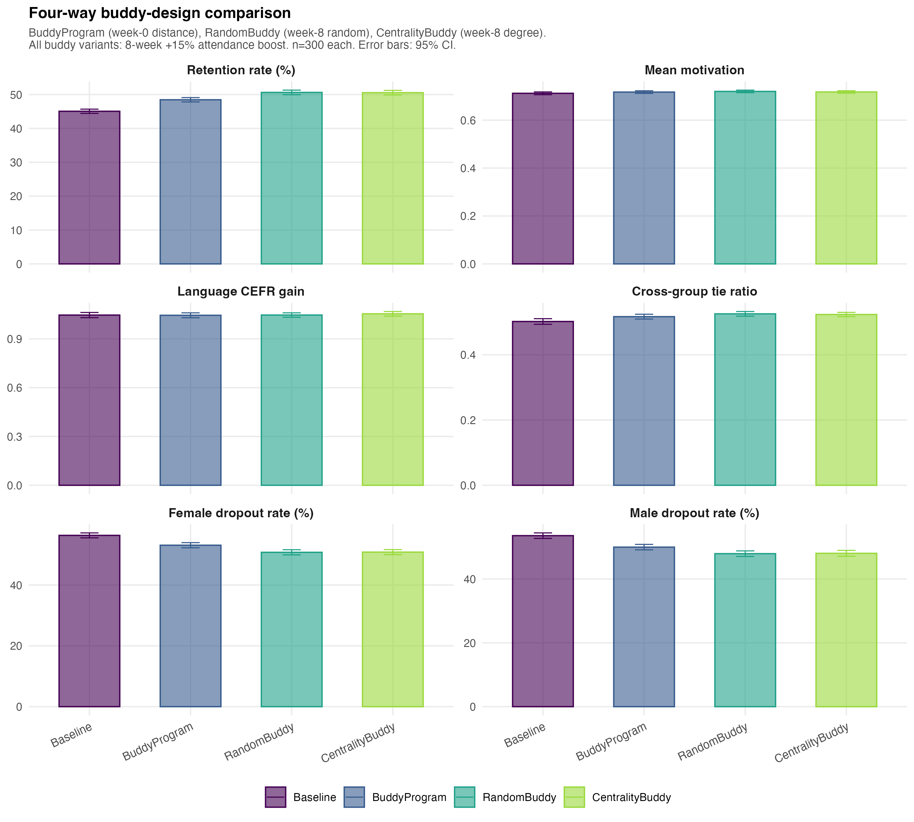
```

**Rotating groups.** RotatingGroups (41.7% retention) slightly underperforms Baseline but achieves the highest cross-group tie ratio (0.528 vs. 0.502), trading retention depth for network breadth.

**Winter coverage (Winter50).** 50% indoor partner coverage recovers most winter retention loss (42.3% vs. 34.2% for full No Indoor), confirming a non-linear dose-response for indoor coverage.

**Women-Only with Childcare (WomenChildcare).** This combined intervention achieves 45.8% retention (comparable to Baseline) and brings the gender dropout gap to near-parity: female dropout (54.6%) and male dropout (54.0%) differ by only 0.5 percentage points -- the smallest gender gap of any scenario, and within Monte-Carlo noise, so it is best read as parity rather than a directional advantage. Within the model's scope (women already attending calisthenics-park programmes), universal childcare fully compensates for the reduced cross-gender peer reinforcement in women-only spaces. This result speaks to programme-design choices conditional on attendance; it does not address the prior, culturally and venue-conditioned decision of whether to attend at all.

**NoIndoor Minimal.** Stacking No Indoor Continuity with Minimal Support produces the worst outcomes of all scenarios (28.4% retention, 0% joint target probability), confirming strong negative interaction effects: the two barriers compound rather than simply add.

Agent-level dropout timing clusters sharply at the week-9 winter onset across all scenarios (Figure below, dashed line at week 9). Dropout clustering at weeks 9--16 is visible in all outdoor scenarios, confirming the 2-week mechanism lag between season transition and threshold exceedance.

\FloatBarrier

```{r fig_dropout_dist, echo=FALSE, fig.scap="Dropout timing distribution by scenario", fig.cap="Dropout timing distribution by scenario (ridgeline density plot). Each ridge shows when agents drop out during the 52-week programme. Colour gradient: purple = early dropout, yellow = late dropout. Rows sorted by median dropout week (latest at top). Labels show scenario name and cumulative dropout rate. Dashed lines mark winter onset (week 9) and winter end (week 28). Scenarios with sharp purple peaks exhibit winter-onset cascades; broad yellow ridges indicate gradual attrition throughout the year.", out.width="100%", fig.pos="H"}
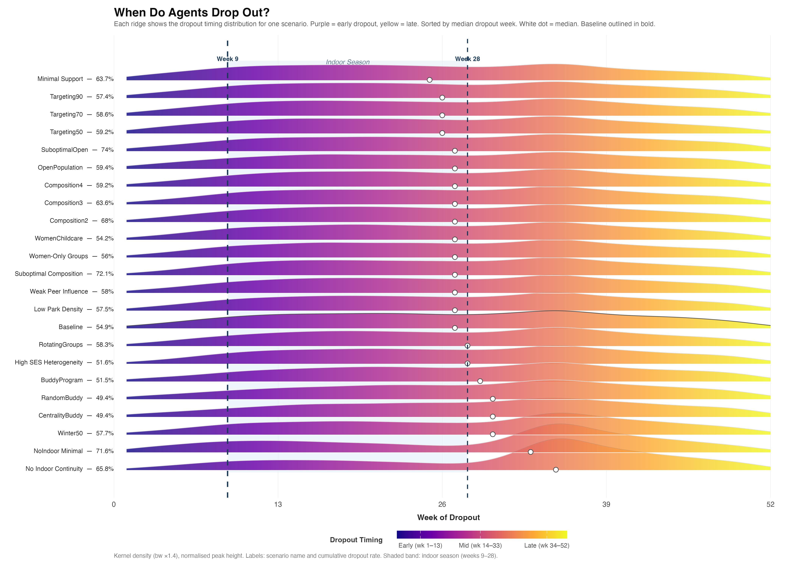
```

Mapping every migrant agent's fate exposes a shifting "survival landscape": the region of initial conditions (motivation and SES) that leads to programme completion contracts sharply under the worst designs.

\FloatBarrier

```{r fig_agent_fate, echo=FALSE, fig.scap="Agent fate map", fig.cap="Agent fate map. Each dot represents one migrant agent (75 per panel). Horizontal position = initial motivation; vertical position = socioeconomic status (SES). Colour encodes dropout week (dark purple = early dropout; bright yellow = late dropout). Black-outlined yellow dots = survived to week 52. Panels sorted by retention rate (worst top-left, best bottom-right). One representative run per scenario (closest to median retention).", out.width="100%", fig.pos="H"}
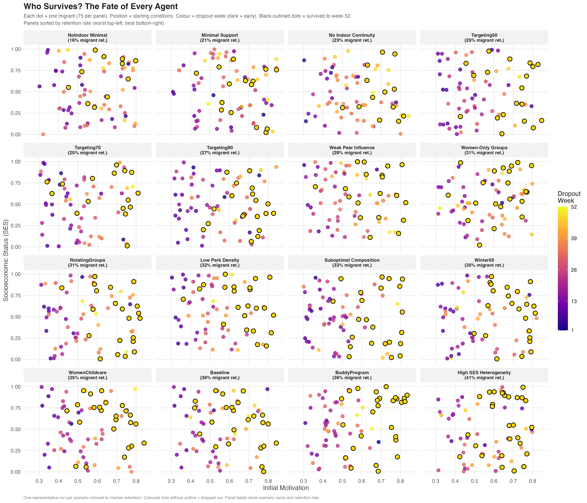
```

Plotted as a cost-retention trade-off against Baseline, the eight additional scenarios split cleanly: BuddyProgram (+3.4 pp retention, -EUR 226 cost) and WomenChildcare (+0.7 pp, -EUR 49) both improve retention and reduce cost, while NoIndoor Minimal and Suboptimal Composition are firmly dominated.

\FloatBarrier

```{r fig_new_tradeoff, echo=FALSE, fig.scap="Additional scenarios: retention vs. cost change", fig.cap="Additional scenarios: retention change (pp) and cost change (EUR) relative to Baseline. Upper-left quadrant = better retention and lower cost than Baseline. BuddyProgram (+3.4 pp, -EUR 226) and WomenChildcare (+0.7 pp, -EUR 49) are the two scenarios in the dominant upper-left quadrant; BuddyProgram has the largest retention uplift. Dashed lines at origin = Baseline.", out.width="90%", fig.pos="H"}
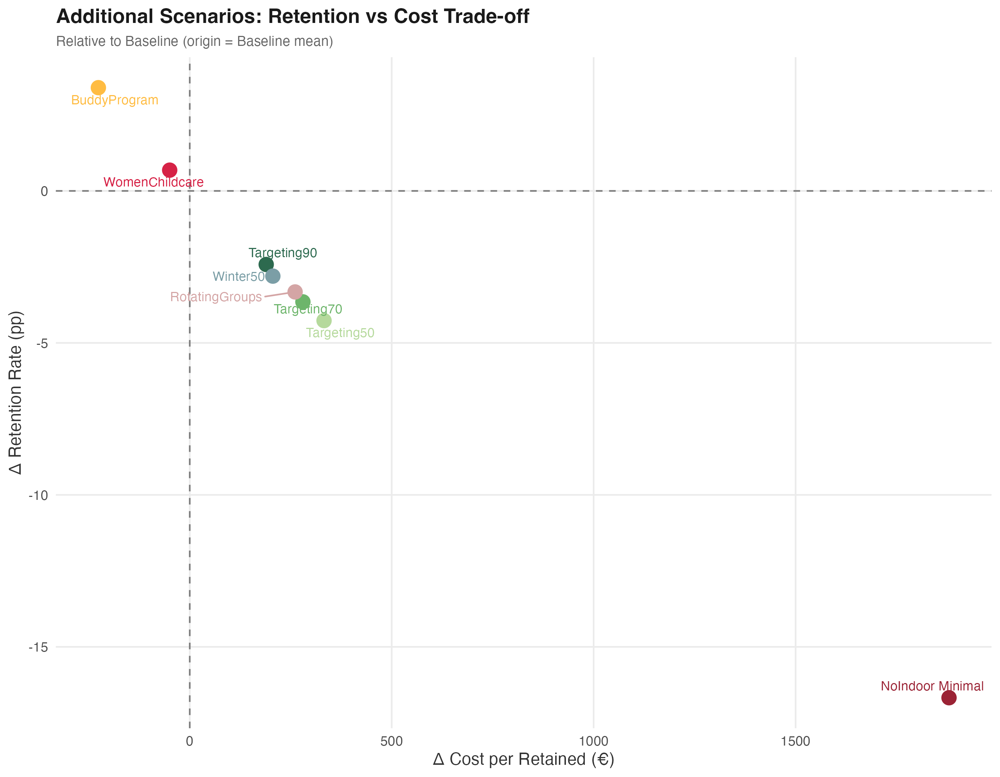
```


## G.2 Network Analysis {-}

Cross-group tie formation is analysed at the agent level using the `cross_group_friends` variable, which records the number of cross-group friends held by each agent at week 52. Since the model does not export full edge lists, the following analysis characterises the *degree distribution* and *assortativity proxies* rather than full graph statistics.

**Degree distribution.** At baseline, the mean cross-group degree per agent is low (migrants: 0.40 friends; locals: 1.16 friends), reflecting the programme's group-size constraint and the low per-session tie-formation rate ($p_{\text{tie}} = 0.05$): each agent can befriend only the cross-group members of its own training group. Of importance, 69--93% of migrants hold zero cross-group friends at week 52 (lowest under RandomBuddy, highest under SuboptimalOpen), a high isolation rate that declines only under scenarios preserving rich group composition. Cross-group degree is lowest under SuboptimalOpen and Suboptimal Composition, and highest under the week-8 buddy scenarios (RandomBuddy, CentralityBuddy), which mandate a cross-group pairing (Figure below).

**Social isolation.** Migrant isolation (zero cross-group friends) reaches 69--93% across scenarios versus 33--87% for locals (Figure below), a structural asymmetry driven by group size (75 migrants vs. 25 locals per programme in the BehaviorSpace experiments). This asymmetry is smallest under Suboptimal Composition, where the scarcity of locals leaves both migrants and locals broadly isolated (the gap collapses to about 4.5 pp), and largest under designs that retain abundant locals, such as Baseline (around 37 pp).

**Assortativity proxies.** Spearman correlations between agent attributes and cross-group degree reveal that initial motivation is the strongest predictor of cross-group tie formation (ρ = 0.43 at baseline), while SES is essentially uncorrelated (ρ = 0.03). Distance to park shows a modest negative association (ρ = −0.14). These results confirm that the social mechanism (motivation → active participation → tie formation) dominates over structural access (SES, distance) in determining integration outcomes.

**Link-prediction structural validation.** As a quantitative test of whether the network module produces ties with learnable triadic structure (rather than randomly placed within training groups), we ran a static link-prediction protocol on the week-52 friendship graphs of four scenarios spanning the design space: Baseline, Suboptimal Composition (sparse network), BuddyProgram (denser, partly mandated cross-group ties), and High SES Heterogeneity. For each run we held out 20% of the edges, built a training graph from the remaining 80%, sampled an equal number of non-edges as negatives, and evaluated four standard predictors using `igraph`: Adamic--Adar [@adamic2003], common neighbours, Jaccard, and preferential attachment. Negative samples were drawn uniformly without replacement from the set of non-edges in the full week-52 graph. Across 964 successfully analysed runs (sparse Suboptimal Composition runs with fewer than 25 edges are excluded by an analysis-stability threshold; only 69 of 300 Suboptimal runs survive this filter, so the highest mean AUC reported below -- Adamic--Adar Suboptimal Composition $= 0.761$ -- reflects the smallest analysed subsample and should be read with that caveat), the three triadic-closure predictors yield mean AUC values between 0.735 and 0.761 in every scenario, all rejecting the chance value 0.5 at $p < 10^{-4}$ in one-sample $t$-tests against the null AUC = 0.5; preferential attachment yields AUC $\approx 0.50$ in every scenario (Baseline 0.499, Suboptimal Composition 0.482, BuddyProgram 0.505, High SES Heterogeneity 0.510; none significantly different from chance after Holm correction across the 16 scenario--predictor cells). The interpretation is substantive: ties in this network form via co-attendance and shared neighbours (triadic closure), not via degree-based "rich get richer" attachment. This is consistent with Granovetter's [-@granovetter1973] weak-tie account and with @centola2007's complex-contagion mechanism for behavioural spread in clustered networks; it is inconsistent with a Barabási--Albert preferential-attachment generative process. We caveat that the model's small training groups and sparse tie formation keep cross-group degree low (Appendix G.2), which compresses degree heterogeneity and would attenuate any preferential-attachment signal even in a graph generated by a BA process; this test is therefore a permissive rather than a discriminating one for ruling out preferential-attachment dynamics in denser networks. Per-scenario AUC summaries are reported in Appendix F.5, the significance tests against chance (AUC = 0.5) in Appendix F.6, and the per-run AUC distribution summary in Appendix F.9. The figure below shows the AUC distribution across scenarios and predictors.

\FloatBarrier

```{r fig_link_prediction, echo=FALSE, fig.scap="Link-prediction AUC by scenario and predictor", fig.cap="Link-prediction AUC across four scenarios and four predictors. Boxplots show the per-run AUC distribution (964 successfully analysed runs out of 1{,}200; 236 runs excluded by the 25-edge threshold, 231 of them sparse Suboptimal Composition). Dashed line: chance value 0.5. Adamic--Adar, common neighbours, and Jaccard all yield AUC $\\approx 0.74$--$0.76$ across all four scenarios with extremely tight per-run distributions; preferential attachment is at chance in every scenario, indicating that degree alone does not predict tie formation in this network.", fig.pos="H", out.width="92%"}
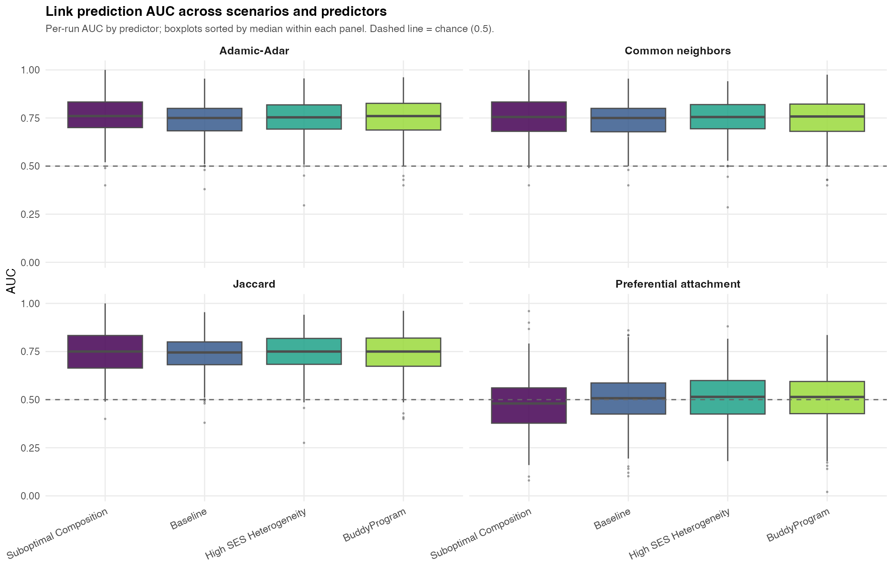
```

\FloatBarrier

```{r fig7_network, fig.scap="Cross-group tie degree distribution", fig.cap="Cross-group tie degree distribution by scenario (all agents × 300–500 runs per scenario). Boxes = median/IQR; whiskers = 1.5×IQR. Suboptimal Composition produces the lowest cross-group degree (mean 0.15 friends); the buddy-pairing variants the highest (RandomBuddy 0.78, CentralityBuddy 0.76), ahead of BuddyProgram (0.70) and High SES Heterogeneity (0.67).", fig.pos="H"}
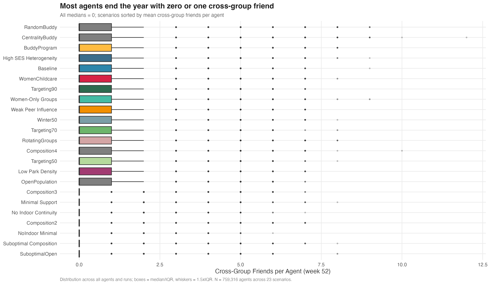
```

\FloatBarrier

```{r fig8_isolation, fig.scap="Social isolation rate by scenario", fig.cap="Social isolation rate (proportion of agents with zero cross-group friends at week 52) by scenario and agent type. Migrant isolation exceeds local isolation in every scenario; the gap spans 4.5 to 39.8 pp. Under Suboptimal Composition the gap collapses to 4.5 pp because both groups are broadly isolated (locals 86\\%, migrants 91\\%); in the other 22 scenarios the structural group-size asymmetry (75 migrants vs 25 locals) produces gaps of roughly 7 to 40 pp.", fig.pos="H"}
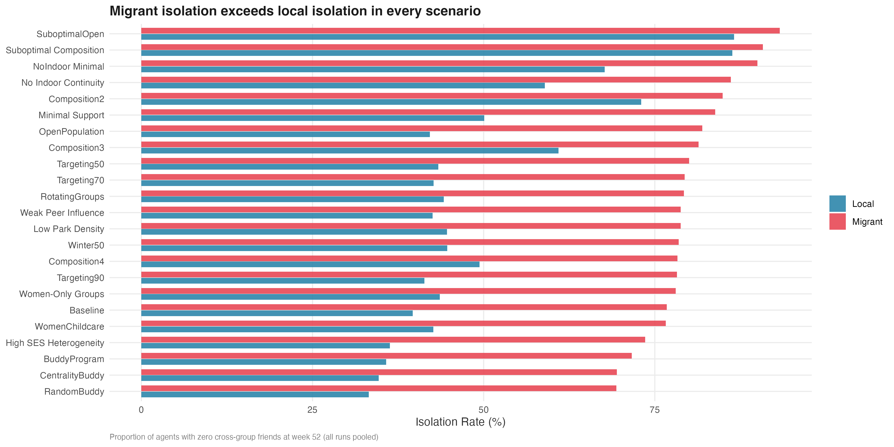
```


## G.3 Structural Network Analysis {-}

The preceding degree-based analysis uses scalar proxies (cross-group friend count, isolation rate) measured from agent-level data. To characterise the *structure* of the emergent friendship networks, we constructed igraph objects from the 5,400 edge-list files exported at week 52 (`CIM_edges_{scenario}_{run}.csv`) and computed six graph-theoretic metrics per run: Louvain modularity $Q$ [@blondel2008], global clustering coefficient, giant component fraction, normalised betweenness centrality, Newman breed assortativity [@newman2003], and mean tie strength by cross-group status. Each scenario is a controlled computational experiment, providing clean identification of the model-world causal effect of scenario design on network structure [@will2020].

**Causal identification.** The ABM provides experimental-quality causal identification at the scenario level: each scenario varies one design parameter with all other inputs held constant and 300 independent random seeds, equivalent to a randomised experiment with no confounders, no attrition, and no non-compliance. Scenario-level effects on both retention and network structure are therefore causally identified within the model world. However, the week-52 network metrics are *post-treatment outcomes* of the retention process itself -- agents who dropped out earlier are absent from the network -- so they cannot serve as independent causal predictors of retention within scenarios. This distinction (causal at the scenario level, associational within scenarios) guides the interpretation of all findings below.

**Network fragmentation.** In most scenarios, only 30--39% of agents belong to the giant component at week 52; the remaining 61--70% are in small disconnected clusters of 2--5 agents or are completely isolated. The exception is RotatingGroups, where group reshuffling every 4 weeks connects 87.8% of agents into a single giant component (Cohen's $d = 5.09$ vs Baseline, $p < 10^{-4}$). This fragmentation explains why the peer influence mechanism (H1) has a relatively modest retention effect ($d = -0.58$): influence can only flow through connected components, and most agents are structurally unreachable.

**Granovetter's weak ties validated.** Cross-group ties are significantly weaker than within-group ties in 14 of the 16 original scenarios after Holm correction (pooled $d = -0.41$, $p < 10^{-4}$); the Appendix G.3 structural network analysis was conducted on the 5,400 edge files exported from the original 16-scenario campaign and not re-run for the Phase 3 robustness extensions. The bridging ties that connect migrant and local communities are weak ties, consistent with Granovetter's [-@granovetter1973] foundational prediction. Within cross-group ties, weaker ties have *higher* edge betweenness ($\rho = -0.43$, $p < 10^{-4}$, $N = 1{,}179$ edges), confirming that the weakest cross-group ties serve as the most important structural bridges [@everett2016]. One scenario reverses this pattern: under Suboptimal Composition, the structural scarcity of locals (1 per park) concentrates interaction on the few available cross-group partners, producing stronger-than-within cross-ties ($d = 0.20$, $p < 0.001$ after Holm correction).

\FloatBarrier

```{r fig_sna_weak_ties, echo=FALSE, fig.scap="Mean tie strength by tie type and scenario", fig.cap="Mean tie strength at week 52 by tie type (cross-group vs within-group) and scenario. Cross-group ties are weaker in 14 of the 16 original scenarios (Holm-corrected; Phase 3 scenarios not included in this SNA analysis); the exception is Suboptimal Composition, where structural scarcity of locals concentrates interaction on cross-group partners. Consistent with Granovetter (1973): bridging ties are weak ties.", fig.pos="H", out.width="90%"}
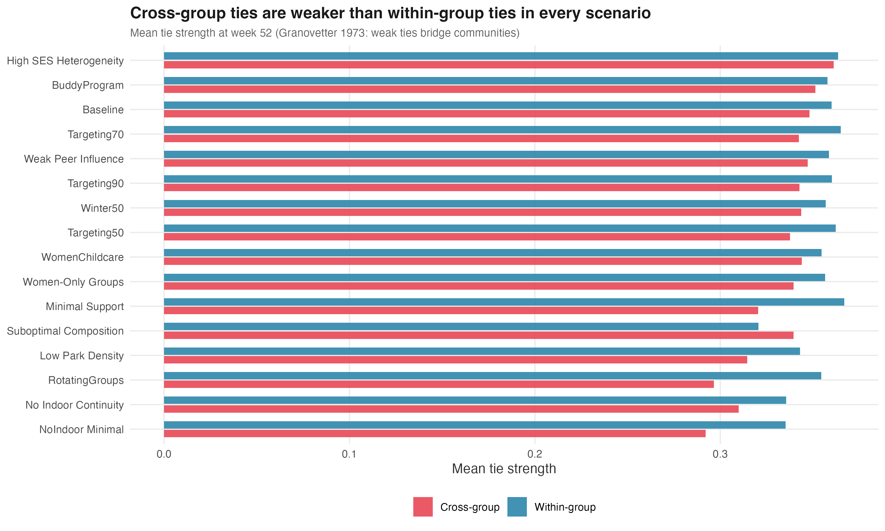
```

**BuddyProgram: motivational, not structural.** Equivalence testing (TOST, $\delta = 0.05$) confirms that BuddyProgram's network structure is indistinguishable from Baseline on all four metrics: modularity ($\Delta = -0.001$, TOST $p < 0.001$), clustering ($\Delta = +0.003$), giant component ($\Delta = -0.001$), and assortativity ($\Delta = -0.018$, TOST $p = 0.001$). Yet BuddyProgram achieves +3.4 pp higher retention ($t = 9.03$, $p < 10^{-4}$). Because the network mediator is provably unchanged while the outcome changes, the retention effect must operate through the direct motivational pathway (the 8-week buddy anchor) rather than through network restructuring. This is mediation by exclusion: path $a \approx 0$ in the Baron--Kenny framework, so the indirect effect is zero regardless of path $b$.

**RotatingGroups: structural integration at a motivational cost.** RotatingGroups produces massive network restructuring: modularity $Q$ drops from 0.708 (Baseline) to 0.575 ($d = -2.13$), clustering from 0.44 to 0.20 ($d = -2.38$), and giant component rises from 30.7% to 87.8% ($d = +5.09$). All effects are significant at $p < 10^{-4}$ with 95% CIs excluding zero. Yet retention is 2.3 pp *lower* than Baseline (41.7% vs 45.1%). Two causal pathways operate in opposition: the structural pathway (more connectivity, better peer influence reach) acts toward higher retention, but the motivational pathway (destruction of stable training groups every 4 weeks) acts toward lower retention. The motivational disruption dominates, producing the net negative effect.

\FloatBarrier

```{r fig_sna_modularity, echo=FALSE, fig.scap="Network modularity by scenario", fig.cap="Network modularity (Louvain) by scenario. Lower Q indicates more integrated network structure. RotatingGroups achieves the lowest modularity (Q=0.57) through group reshuffling but at the cost of reduced retention. BuddyProgram is structurally indistinguishable from Baseline (TOST equivalence p<0.001).", fig.pos="H", out.width="90%"}
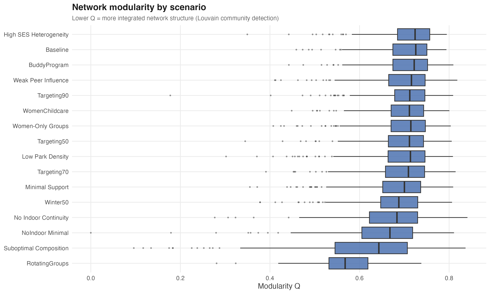
```

**Contact Hypothesis mechanism confirmed.** Within the Baseline scenario ($N = 22{,}500$ migrant agents), weeks attended correlates strongly with cross-group friends ($\rho = +0.66$, $p \approx 0$), and distance to park correlates negatively ($\rho = -0.15$, $p < 10^{-4}$). Structured co-attendance at training sessions is the primary driver of cross-group tie formation, consistent with Allport's [-@allport1954] conditions and the Contact Hypothesis meta-analysis [@pettigrew2006].

```{r sna_table, echo=FALSE}
sna_tbl <- read.csv("tables/table_sna_metrics.csv")
sna_display <- sna_tbl %>%
  select(Scenario = scenario, N = n_runs,
         `Mod. Q` = mod_q_mean,
         `Clust.` = cc_mean,
         `GC frac.` = gc_frac_mean,
         `Assort.` = assort_mean) %>%
  mutate(across(where(is.numeric) & !matches("N"), ~round(.x, 3)))
knitr::kable(sna_display, booktabs = TRUE, format = "latex",
  caption = "Structural network metrics by scenario (mean across runs).", caption.short = "Structural network metrics by scenario",
  align = c("l","r","r","r","r","r")) |>
  kableExtra::kable_styling(font_size = 8, latex_options = "hold_position") |>
  kableExtra::footnote(
    general = "Mod. Q = Louvain modularity; Clust. = global clustering coefficient; GC frac. = giant-component fraction; Assort. = Newman breed assortativity (negative = disassortative = more cross-group mixing).",
    general_title = "Column key: ",
    footnote_as_chunk = TRUE, threeparttable = TRUE, escape = TRUE
  )
```

**Caveats.** These networks are small (approximately 100 nodes, 30--60 edges per run) and sparse, so absolute values of modularity and betweenness should be interpreted comparatively across scenarios rather than against benchmarks from large-scale empirical networks. The week-52 snapshot captures surviving ties only; agents who dropped out earlier are absent from the network, creating survivorship bias in all structural metrics. Within-scenario correlations between network metrics and retention are near-zero (all $\rho < 0.09$), confirming that the feedback loop between retention and network structure prevents within-scenario causal identification. The scenario-level comparisons (where one design parameter is experimentally varied) remain the primary source of causal claims.


## G.4 Framework-generality and Robustness Findings {-}

This section reports the framework-generality and robustness extensions introduced in the v6.4 release: sensitivity-analysis provenance, gamma-bracket robustness, open-population dynamics, and a second-domain portability test against a Berlin language-course calibration. Each extension is motivated by a question raised during Tier 1 peer review or by the programme director's suggestion that the model-world tool should be evaluated as a generalisable framework rather than an Istanbul-specific case study.

### Sensitivity-analysis provenance and version-invariance {-}

The dominant sensitivity result, $\text{PRCC}(\gamma, \text{retention}) = -0.96$, is computed under `CIM_v6_4.nlogo` (Section 4.4). This section documents that the estimate is version-invariant *by construction*: the sweep exercises a code path that is byte-identical across the v6.2--v6.4 releases, so the same value would be obtained under any of them.

The `Sensitivity_3level` BehaviorSpace experiment runs the Baseline scenario at $3^4 = 81$ combinations of $(\beta, \gamma, p_{\text{tie}}, \theta_d)$ with 10 replicates each, for 810 runs total. The executed code path in the `go` procedure is byte-identical across v6.2, v6.3, and v6.4. Between v6.2 and v6.3 the calibrated parameter values and baseline scenario configuration were unchanged. Between v6.3 and v6.4 the Tier 2 refactor introduced a configuration-file loader and 28 `cfg-*` globals (26 in the original Tier 2 commit; 2 added for the Phase 3 OpenPopulation extension, `cfg-inflow-rate-per-week` and `cfg-outflow-rate-per-week`) whose defaults match the v6.3 literals; the Baseline run at seed 42 is bit-identical between v6.3 and v6.4 (T2.4 regression test).

Because every code path exercised by the sensitivity experiment is byte-identical across versions, the joint output distribution is version-invariant: the $\text{PRCC}(\gamma, \text{retention}) = -0.96$ value computed from the v6.4 sweep is the same value the v6.2 and v6.3 code paths would produce. This is a code-path-identity argument anchored on the v6.3$\leftrightarrow$v6.4 bit-identical regression test, not a claim of three independent re-runs.

### Gamma-bracket ranking robustness {-}

The motivation-decay-rate $\gamma$ is calibrated at 0.018 per week from @gjestvang2020. Classmate peer review raised the concern that this value, drawn from a Norwegian supervised-fitness-club cohort, may not transfer to migrants under compounding stressors. The gamma-bracket sweep evaluates $\gamma \in \{0.011, 0.018, 0.025\}$ -- the central value plus a $\pm 40\%$ bracket -- across three scenarios (Baseline, BuddyProgram, Suboptimal Composition), with 300 runs per cell:

\begin{table}[H]
\centering
\caption[Gamma-bracket robustness of retention]{Retention (\%) under a $\pm 40\%$ bracket on the motivation-decay rate $\gamma$ (300 runs per cell, three scenarios).}
\footnotesize
\begin{tabular}{lccc}
\toprule
 & BuddyProgram & Baseline & Suboptimal Comp. \\
\midrule
$\gamma = 0.011$ (low)     & 75.4\% & 71.9\% & 56.2\% \\
$\gamma = 0.018$ (central) & 48.5\% & 45.1\% & 27.9\% \\
$\gamma = 0.025$ (high)    & 23.4\% & 21.1\% & 11.1\% \\
\bottomrule
\end{tabular}
\end{table}

The ranking `BuddyProgram > Baseline > Suboptimal Composition` holds at all three values of $\gamma$. The decay rate scales retention multiplicatively, consistent with its role as a uniform first-order loss term, and does not reverse scenario orderings within the Istanbul-calisthenics calibration. The bracket is robust in rank but sensitive in level: a mis-calibration of $\gamma$ by $\pm 40\%$ shifts Baseline retention from 21.1\% to 71.9\%, underscoring that model-derived absolute estimates should be read as model-world outputs, not real-world forecasts.

### Open-population dynamics {-}

The v6.4 model assumes a closed population: no arrivals, no departures during the 52-week programme. To test whether this simplification drives retention estimates, the `OpenPopulation` scenario adds weekly Bernoulli probabilities of one new arrival ($p_{\text{in}} = 0.30$) and one random active-participant departure ($p_{\text{out}} = 0.20$). Arrival and departure at these rates correspond to roughly 15 arrivals and 10 departures over the year on a base of 75 migrants. The full six-outcome comparison against closed-population Baseline (300 runs each; Welch $t$-tests, Holm-corrected within this six-outcome comparison) reveals a differential pattern.

**Quantitative outcomes shift; one network-structure metric is invariant.** Retention falls $-4.5$ percentage points under open population (40.6% vs 45.1%; Cohen's $d = -0.82$, large; Holm-adjusted $p < 10^{-4}$), and language CEFR gain falls by 0.195 levels ($d = -1.44$, large; $p < 10^{-4}$) -- the largest single shift produced by any robustness perturbation, larger than any of the H1--H4 confirmatory manipulations on CEFR. Mean motivation falls $-0.016$ ($d = -0.34$, small; Holm $p < 10^{-4}$). Female and male dropout rates rise symmetrically by $+4.4$ and $+4.4$ percentage points ($d = +0.64$, $+0.59$; Holm $p < 10^{-4}$ for both). In contrast, the **cross-group tie ratio is essentially unchanged** (0.499 vs 0.502; $d = -0.03$; $p = 0.69$, not significant). To verify whether this single-metric finding generalises, a follow-up multi-metric SNA comparison (\path{R/28_open_pop_sna.R}) computed five additional metric families (six graph-theoretic tests) on the 600 OpenPopulation and Baseline edge files: Louvain modularity $Q$ (Baseline 0.706 vs OpenPopulation 0.702; $d = -0.065$), global clustering coefficient (0.438 vs 0.425; $d = -0.125$), giant-component fraction (0.307 vs 0.311; $d = +0.058$), Newman breed assortativity ($-0.044$ vs $-0.053$; $d = -0.060$), and mean tie strength split by cross-group status (cross-group: 0.348 vs 0.341, $d = -0.16$; within-group: 0.360 vs 0.356, $d = -0.09$). **None of the six graph-structure metrics differs significantly** between the two scenarios after Holm correction within the 6-test family (all six effects negligible, $|d| \le 0.16$; all Holm-adjusted $p > 0.2$; full table in Appendix F.7). The network metrics tested -- modularity, clustering, fragmentation, breed-mixing, and tie-strength composition -- are invariant to the tested open-cohort regime; we caveat that other graph-structure properties not tested (degree-distribution shape, network diameter, k-core decomposition, motif counts, temporal trajectory of these metrics across weeks rather than at week-52 only) cannot be ruled in or out from this analysis. By contrast, the time-dependent quantitative outcomes (retention, language gain) shift in the direction predicted by the mechanism (new arrivals enter mid-programme with shorter exposure windows, mechanically reducing average language proficiency and pushing the mean retention down). Note that the inflow rate $p_{\text{in}} = 0.30$ exceeds $p_{\text{out}} = 0.20$ (a net-inflow asymmetry); we have not tested the symmetric or net-outflow regime.

The closed-population simplification therefore does not drive the main qualitative Baseline finding. To directly test whether the *Baseline-vs-Suboptimal* ranking preserves under churn, we ran the additional `SuboptimalOpen` scenario (1 local per park combined with $p_{\text{in}} = 0.30$ / $p_{\text{out}} = 0.20$ inflow/outflow rates). Across 300 runs, SuboptimalOpen retention reaches 26.00% versus 27.89% for Suboptimal Composition (closed); the open-population effect on the Suboptimal scenario is a smaller absolute drop than on Baseline ($-1.89$ pp vs $-4.46$ pp; Cohen's $d = -0.41$, small; Holm-adjusted $p < 10^{-4}$ within a 36-test 4-scenario family; the full pairwise comparison is reported in Appendix F.10). Critically, the **Baseline-vs-Suboptimal ranking is preserved in BOTH cohort regimes** (an H2-specific test; H1, H3, H4 manipulations were not re-run under open population): Baseline (45.07%) > Suboptimal (27.89%) under closed cohort with a 17.18 pp gap; OpenPopulation (40.61%) > SuboptimalOpen (26.00%) under open cohort with a 14.60 pp gap. The gap *attenuates by 2.57 pp* (a 15.0\% relative reduction) under the calibrated churn rates -- a directional signal that the composition effect is partially dampened by churn; we do not bracket the churn rate at which the ranking would break, and we explicitly limit this finding to H2 rather than implying it generalises to H1, H3, H4. The remaining within-regime contrasts are highly significant ($d = -3.31$ closed Baseline vs Suboptimal and $d = -2.95$ open OpenPopulation vs SuboptimalOpen, both Holm-$p < 10^{-4}$). The overall pattern -- six-of-six graph-structure metrics invariant to churn, AND the headline composition-ranking preserved across cohort regimes -- provides a defensible robustness narrative: structural integration claims (modularity, clustering, bridging-tie composition) and headline policy ranks survive realistic open-cohort dynamics, while absolute language-gain forecasts are mechanically sensitive to cohort turnover and should be interpreted as model-world outputs rather than real-world point estimates. Programmes with higher turnover than tested, or with net-outflow rather than net-inflow, would require independent calibration.

\FloatBarrier

```{r fig_open_pop, echo=FALSE, fig.scap="Open-population robustness (six outcomes)", fig.cap="Open-population robustness. Six-outcome comparison of closed-cohort Baseline ($n = 300$) versus open-cohort OpenPopulation ($n = 300$, weekly $p_{\\text{in}} = 0.30$, $p_{\\text{out}} = 0.20$). Bars: mean; error bars: 95\\% CI. Retention, motivation, language CEFR gain, and dropout rates shift by significant amounts under churn ($|d|$ from 0.34 to 1.44); cross-group tie ratio is essentially unchanged ($d = -0.03$, $p = 0.69$). The differential pattern -- quantitative outcomes shift, qualitative network structure preserves -- is documented in the per-outcome and comparative-magnitude tables saved to the tables directory.", fig.pos="H", out.width="92%"}
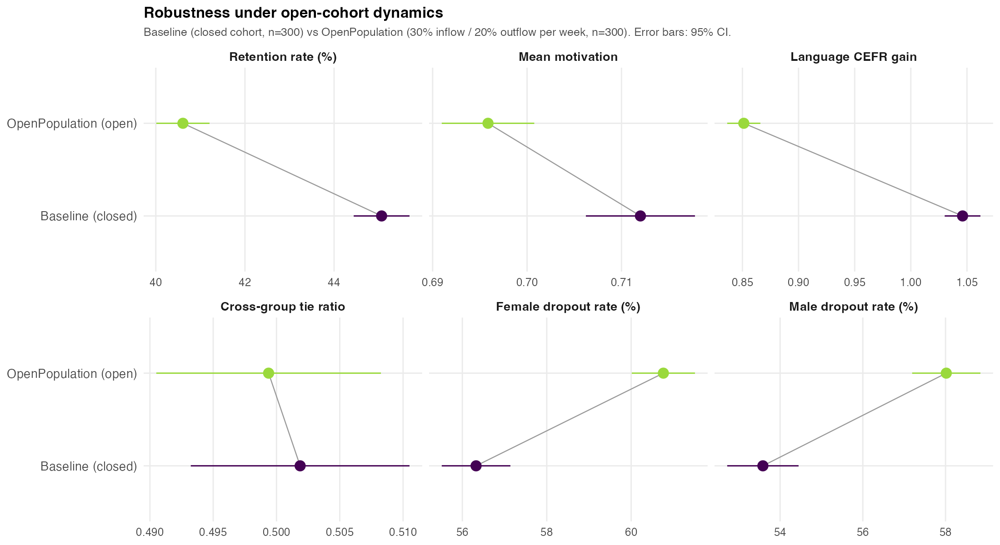
```

### Berlin language-course: a second-domain test {-}

To test whether the framework-level claims transfer beyond community sport, the v6.4 release implements a second-domain calibration representing Berlin Federal Office for Migration and Refugees (BAMF) integration courses [@kosyakova2021]. The Berlin configuration differs from Istanbul on 35 of 44 parameter rows (the nine shared values include the peer-influence coefficient $\beta = 0.08$ and the initial tie strength 0.20): a lower motivation-decay rate (0.015 per week) offset by funded-attendance enforcement, a higher CEFR gain rate (0.024 vs 0.019 per hour) reflecting formal instruction, a one-instructor-per-twenty-migrant classroom in place of peer-dense community groups, absence of an outdoor-season regime (indoor year-round), and denser urban transit reducing distance barriers. Thirteen scenarios were run in the Berlin configuration with 300 replicates each, for 3,900 runs total. The three non-transferable scenarios (No Indoor Continuity, NoIndoor Minimal, Winter50) are marked N/A.

Five pre-registered ranking relations from the Istanbul analysis were tested in both domains; four (Suboptimal Composition < Baseline, Suboptimal Composition < BuddyProgram, Minimal Support < Baseline, Baseline < BuddyProgram) were fully testable, while the fifth (NoIndoor Minimal < Baseline) is Istanbul-only because NoIndoor Minimal is N/A in Berlin. All four are overwhelmingly significant in the home domain (Istanbul Welch $t$-tests, every $p < 10^{-4}$), so Berlin is a fair transfer test. In Berlin, **only two of the four transfer**. Minimal Support < Baseline holds decisively: support-service removal lowers retention from 67.0\% to 51.2\% ($-15.9$ pp, Cohen's $d = 3.40$, $p < 10^{-4}$). Suboptimal Composition < BuddyProgram holds marginally ($+0.8$ pp, $d = 0.18$, one-sided $p = 0.03$). The remaining two are directionally consistent but statistically flat: **Suboptimal Composition < Baseline** -- which in Istanbul-calisthenics is a large effect, the 5-to-1 local-per-park reduction lowering retention from 45.1\% to 27.9\% ($-17.2$ pp, $d = -3.31$) -- shrinks in Berlin to 66.7\% against a Baseline of 67.0\% (a $-0.3$ pp difference, $p = 0.42$, not significant); and **Baseline < BuddyProgram** likewise shrinks to 67.0\% vs 67.5\% ($+0.5$ pp, $p = 0.18$, not significant). In the funding-enforced classroom the higher-performing designs cluster tightly at 66--68\% retention and become statistically indistinguishable: the fine-grained ordering among good designs does not transfer, and only the gross distinction between providing and withholding support survives.

```{r hero_fig, out.width="95%", fig.scap="Ranking matrix: Istanbul vs. Berlin", fig.cap="Ranking matrix across Istanbul-calisthenics (top row) and Berlin-language-course (bottom row). Cells report mean retention rate (\\%); fill colour encodes retention on a shared scale across both rows. Of four fully-testable ranking relations, only two transfer to Berlin (Minimal Support < Baseline, $d = 3.40$; and, marginally, Suboptimal Composition < BuddyProgram). The two relations among the top-clustered designs -- Suboptimal Composition vs Baseline (66.7 vs 67.0) and Baseline vs BuddyProgram (67.0 vs 67.5) -- collapse to non-significant 0.3--0.5 pp differences in Berlin. Three scenarios (No Indoor Continuity, NoIndoor Minimal, Winter50) are Istanbul-only and marked N/A in the Berlin row.", echo=FALSE}
knitr::include_graphics("outputs/hero_figure_2x16_ranking.pdf")
```

The interpretation is a partial-generality finding. Across a community-sport context and a state-funded classroom context that differ on most calibrated parameters, the *gross* ranking transfers -- providing versus withholding support (Minimal Support < Baseline) is a large, significant effect in both domains -- but the *fine-grained* ordering among the better designs does not. The two collapsing relations identify a structural boundary common to all peer-mediated levers: both the Suboptimal Composition manipulation and the BuddyProgram premium operate in Istanbul through the local peer pool from which peer-influence and tie-formation opportunities arise; in the Berlin classroom, attendance is funding-conditional and teacher-led rather than peer-reinforced, so altering the number or pairing of non-migrant peers has a muted effect on the dropout pathway. The mechanism is domain-consistent -- it simply finds no purchase in a domain where its input signal is structurally suppressed. This is informative for programme designers: the cost of violating balanced group composition, and the benefit of buddy pairing, are both highest in peer-influence-dominated venues and negligible where attendance is externally enforced.


## G.5 Mechanism Robustness Check: Alternative Mechanism Benchmark {-}

To assess whether the model's outcomes are specific to the tie-weighted peer influence mechanism or could emerge from alternative motivation dynamics, we tested a **contact-presence contagion** mechanism. In this alternative specification, motivation spreads as a function of the fraction of group members attending each week (independent of tie strength) rather than through the weighted social network. This benchmark tests whether the assumed motivation mechanism is consequential or whether a simpler alternative produces equivalent macro-level outcomes.

```{r equifinality_load, echo=FALSE, message=FALSE, warning=FALSE}
eq_tbl <- readRDS("data/equifinality_comparison.rds")
```

```{r equifinality_table, echo=FALSE, message=FALSE, warning=FALSE}
library(knitr)
eq_display <- eq_tbl %>%
  select(metric, baseline_mean, equifin_mean, diff, cohens_d, p_value) %>%
  mutate(
    p_fmt = ifelse(p_value < 0.001, "< 0.001", sprintf("%.3f", p_value)),
    sig   = case_when(p_value < 0.001 ~ "***",
                      p_value < 0.01  ~ "**",
                      p_value < 0.05  ~ "*",
                      TRUE            ~ "")
  ) %>%
  select(Metric = metric,
         `Baseline (mean)` = baseline_mean,
         `Contact-contagion (mean)` = equifin_mean,
         `Difference` = diff,
         `Cohen's d` = cohens_d,
         `p_value` = p_fmt,
         ` ` = sig)

knitr::kable(eq_display, booktabs = TRUE, format = "latex",
      caption = "Mechanism comparison: tie-weighted peer influence (Baseline) vs contact-presence contagion (Alternative Mechanism Benchmark).", caption.short = "Mechanism comparison (peer influence vs. contagion)",
      align = c("l","r","r","r","r","r","l")) |>
  kableExtra::kable_styling(font_size = 8, latex_options = "hold_position") |>
  kableExtra::column_spec(1, width = "3.2cm") |>
  kableExtra::footnote(
    general = "Welch t-test. Retention, motivation, cost, and both dropout rates differ at p < 0.001; language CEFR gain (p = 0.32) and cross-group tie ratio (p = 0.71) do not differ significantly. Significance: *** p < 0.001, ** p < 0.01, * p < 0.05.",
    general_title = "Note: ",
    footnote_as_chunk = TRUE, threeparttable = TRUE, escape = TRUE
  )
```

The two mechanisms produce **substantially different outcomes** (Table above). The contact-presence contagion model generates 12.5 percentage points higher retention (57.5% vs 45.1%, Cohen's *d* = 2.24, *p* < 0.001), 23% higher average motivation, and 22% lower cost per retained participant. Notably, the divergence is confined to the motivation--retention--cost pathway: language CEFR gain (*p* = 0.32) and cross-group tie ratio (*p* = 0.71) are statistically indistinguishable between the two mechanisms, so the contact-presence specification inflates motivation and retention without altering the network structure or the language trajectory. The motivation trajectories diverge from the first weeks of the simulation (Figure below), indicating a structural difference in dynamics rather than a convergent end-state.

```{r equifinality_fig, echo=FALSE, fig.scap="Motivation trajectories: peer influence vs. contagion", fig.cap="Motivation trajectories under tie-weighted peer influence (Baseline, blue) vs contact-presence contagion (Alternative Mechanism Benchmark, red). Shaded bands show interquartile range across runs. The mechanisms diverge from the outset and do not converge.", out.width="90%"}
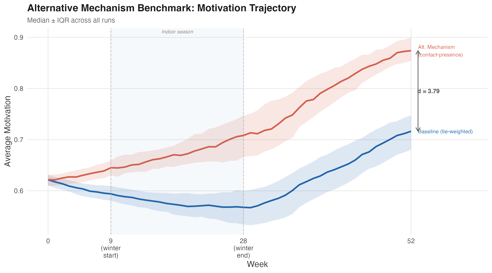
```

The two specifications are therefore **not equifinal**: the choice of motivation model is consequential. The tie-weighted peer influence mechanism produces more conservative, empirically grounded estimates, consistent with the social capital literature showing that tie *quality* (not mere co-presence) drives sustained behavioural change [@putnam2000]. The contact-presence specification, while simpler, implicitly assumes that passive attendance is as motivating as active social bonding, which is not supported by the sport-integration literature. We therefore retain the tie-weighted mechanism as the primary model specification. We note, however, that the comparison conflates mechanism *type* (network-mediated vs. mass-contact) with mechanism *strength* (the contact-presence specification has a larger effective influence pool). A fully controlled comparison would equalise total influence magnitude before testing structural differences; this remains an avenue for future work.


## G.6 Inference-robustness checks (difference-in-differences and randomization inference) {-}

**Difference-in-differences validation.** Two time-varying-treatment scenarios admit a parallel-trends test: No Indoor Continuity and Winter50 differ from Baseline only at indoor-season onset (week 9). The pre-treatment period (weeks 1--8) is identical by construction; pre-treatment mean motivation is 0.558 across all three scenarios with placebo within-pre DiD = $+0.0005$ (parallel-trends assumption holds by construction, since the pre-period is identical across scenarios, not by empirical test). At indoor-season onset, trajectories diverge: treatment-period DiD = $-0.049$ for No Indoor Continuity and $-0.013$ for Winter50 (consistent with the latter's milder manipulation: 50% indoor-partner availability versus full removal). Post-treatment DiD (weeks 29--52) is substantially larger than the treatment-period DiD ($-0.147$ for No Indoor Continuity; $-0.034$ for Winter50), reflecting cumulative dropout cascades that persist after the treatment formally ends. This DiD is a mechanism-timing validation that corroborates, rather than independently identifies, the scenario-level effects: the trends break exactly when, and only when, the treatment fires, while the pre-treatment placebo is near-zero by construction.

```{r fig_did_parallel_trends, echo=FALSE, fig.scap="Difference-in-differences parallel-trends test", fig.cap="Difference-in-differences parallel-trends test for time-varying scenarios. Mean motivation among active agents per week, averaged across N = 300 runs per scenario; ribbons show $\\pm 1$ SE across runs (very narrow at this $N$). Treatment period (weeks 9--28, indoor season) is shaded. Pre-treatment trends (weeks 1--8) are identical by construction, supporting the parallel-trends assumption; the post-treatment DiD persists and compounds after winter onset (largest for No Indoor Continuity). Full DiD estimates are reported in Appendix G.6.", fig.pos="H", out.width="92%"}
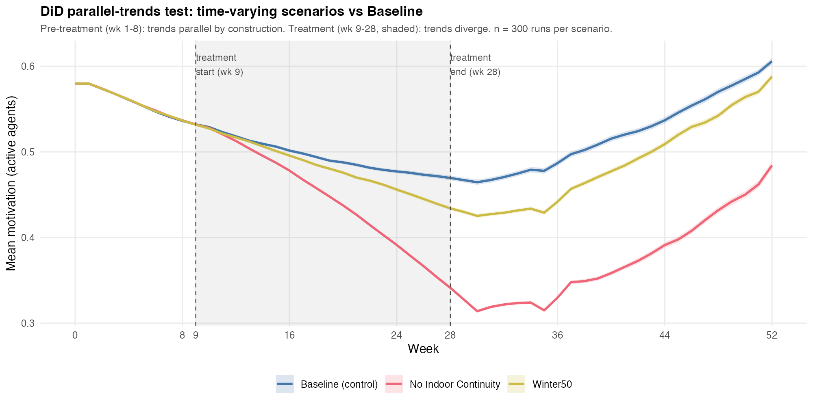
```

**Randomization-inference robustness check.** As a second inference layer that does not rely on the normal approximation underlying Welch's $t$-test, we ran randomization-inference (RI) permutation tests on all 24 confirmatory comparisons (4 scenarios $\times$ 6 outcomes; 10,000 permutations each; sharp-null hypothesis $\tau_i = 0$ for all units; two-sided $p$-values; Holm correction applied within the confirmatory family, matching the methodology used for the parametric tests above). RI agreed with Welch+Holm on significance for **24 of 24 tests** (100% agreement). The 19 tests significant under Welch+Holm are all significant under RI+Holm; the 5 borderline non-significant tests (Weak Peer Influence on motivation, language, and cross-tie ratio; Minimal Support on motivation and language) are non-significant under RI as well. RI's $p$-value resolution is bounded below by $1/(N_{\text{perm}} + 1) \approx 10^{-4}$, so for the most extreme tests (e.g., Suboptimal Composition retention with Welch $p < 10^{-4}$) RI cannot match the parametric resolution but confirms the qualitative rejection. The full RI vs Welch+Holm comparison is reported in Appendix F.1; the underlying permutation distributions (10,000 samples per test) are non-tabular and are retained with the analysis outputs rather than reproduced inline.
